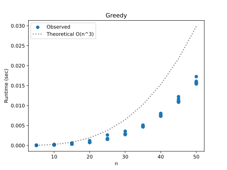
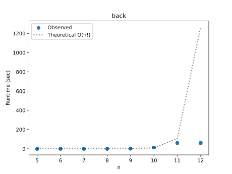
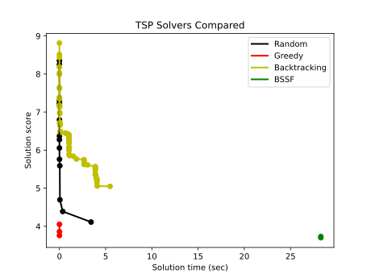
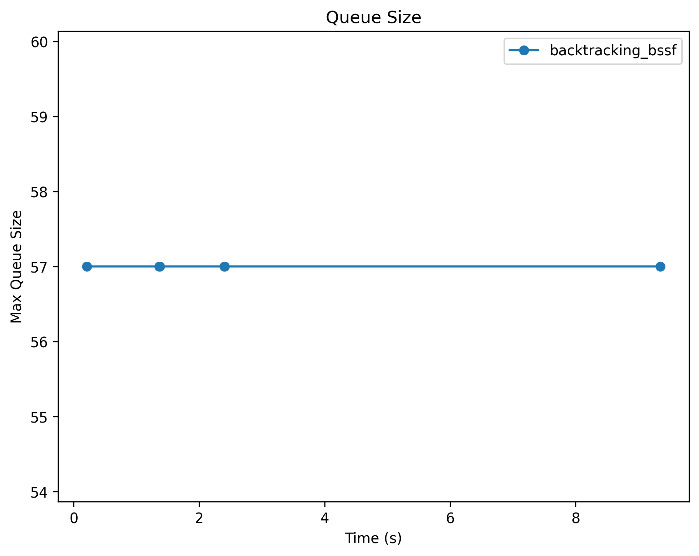
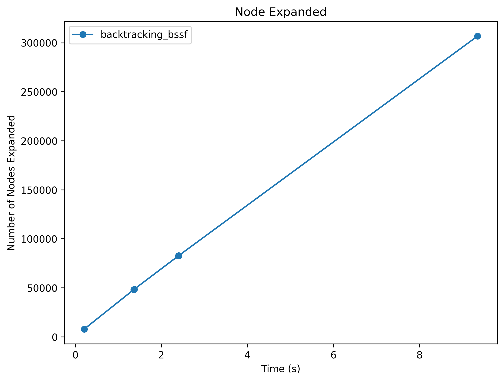
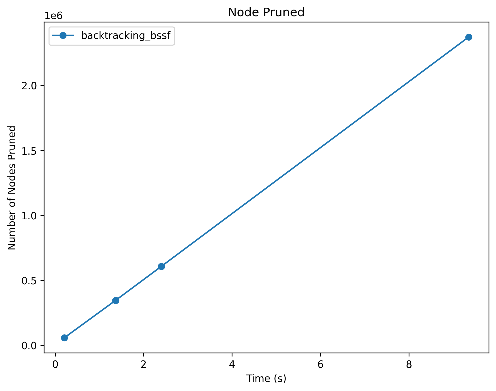
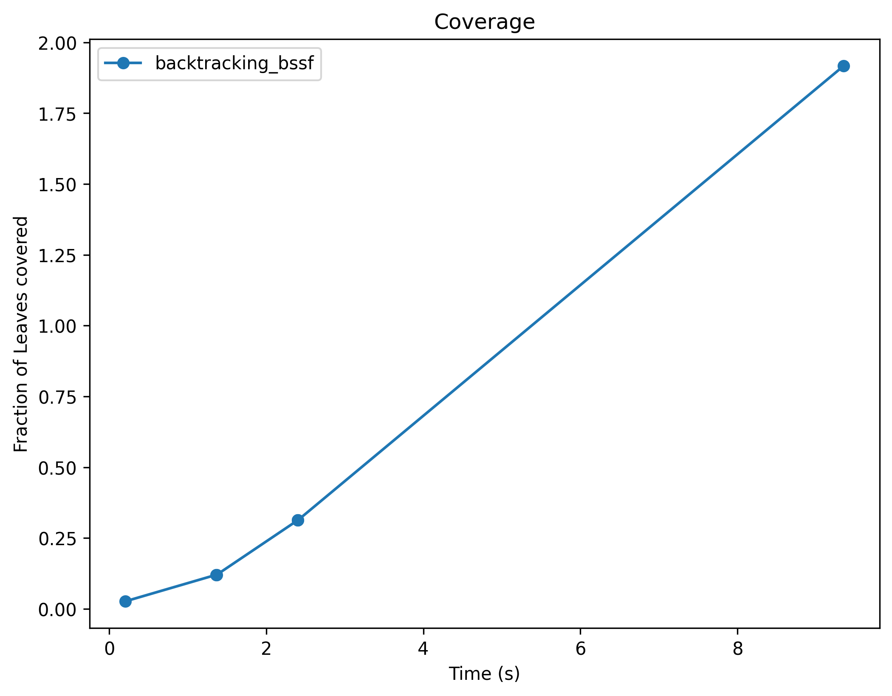

# Project Report - Backtracking
__This is late because me and other TAs thought there was a run time issue and they said it was fine to fix and return in with no penalty.__
## Baseline

### Design Experience

I talked with ___ about what the bases cases were going to be. How if we have a visited list of the same length as how many places we have then its a solution. We also noted how the greedy algorithm should take the first lowest min, not the second as some weights could be the same.

### Theoretical Analysis - Greedy

#### Time 

This is going to be __O(n^3)__ becuase of the while loop and for loop. The while is responsible for n^2 because it is not only searching a current path, it gets reset to do that again for starting at a new spot. For loop add another n to find which path to take next.
```
def greedy_tour(edges: list[list[float]], timer: Timer) -> list[SolutionStats]: # O(n^3)
    solutions = []
    started = 0
    ind = started
    visited = []
    best = math.inf
    timer = Timer(15)

    while not timer.time_out():     # O(n^2) or until it times out
        if started == len(edges):
            break
        visited.append(ind)
        if len(visited) == len(edges):
            tour = Tour(visited)
            cost = score_tour(tour, edges)
            if cost < best:
                solutions.append(SolutionStats(
                tour=tour,
                score=cost,
                time=timer.time(),
                max_queue_size=0,
                n_nodes_expanded=0,
                n_nodes_pruned=0,
                n_leaves_covered=0,
                fraction_leaves_covered=0))
                best = cost
            else:
                visited = []
                started += 1
                ind = started
                continue
        else:
            min = math.inf

            for i in range(len(edges[ind])): # O(n)
                if i in visited:
                    continue
                if edges[ind][i] == math.inf:
                    continue
                elif edges[ind][i] < min:
                    newindex = i
                    min = edges[ind][i]
                    
            if min == math.inf:
                visited = []
                started += 1
                ind = started
                continue
            else:
                ind = newindex

    if len(solutions) == 0:
        return [SolutionStats(
            [],
            math.inf,
            timer.time(),
            1,
            0,
            0,
            0,
            0)]
    else:
        return solutions
```

#### Space

Space complexity for this is going to be __O(n)__ due mainly to solutions which will hold multiple things. The worst case senario is that it returns just as many paths as edges.
```
def greedy_tour(edges: list[list[float]], timer: Timer) -> list[SolutionStats]: # O(n)
    solutions = []  # O(n)
    started = 0
    ind = started
    visited = []    # O(n)
    best = math.inf
    timer = Timer(15)

    while not timer.time_out():
        if started == len(edges):
            break
        visited.append(ind)
        if len(visited) == len(edges):
            tour = Tour(visited)
            cost = score_tour(tour, edges)
            if cost < best:
                solutions.append(SolutionStats(
                tour=tour,
                score=cost,
                time=timer.time(),
                max_queue_size=0,
                n_nodes_expanded=0,
                n_nodes_pruned=0,
                n_leaves_covered=0,
                fraction_leaves_covered=0))
                best = cost
            else:
                visited = []
                started += 1
                ind = started
                continue
        else:
            min = math.inf

            for i in range(len(edges[ind])):
                if i in visited:
                    continue
                if edges[ind][i] == math.inf:
                    continue
                elif edges[ind][i] < min:
                    newindex = i
                    min = edges[ind][i]
                    
            if min == math.inf:
                visited = []
                started += 1
                ind = started
                continue
            else:
                ind = newindex

    if len(solutions) == 0:
        return [SolutionStats(
            [],
            math.inf,
            timer.time(),
            1,
            0,
            0,
            0,
            0)]
    else:
        return solutions
```

### Empirical Data - Greedy

| Size | Reduction | Time (sec) |
| ---- | --------- | ---------- |
| 5    | 0         | 0.0        |
| 10   | 0         | 0.0        |
| 15   | 0         | 0.0        |
| 20   | 0         | 0.001      |
| 25   | 0         | 0.002      |
| 30   | 0         | 0.003      |
| 35   | 0         | 0.005      |
| 40   | 0         | 0.008      |
| 45   | 0         | 0.011      |
| 50   | 0         | 0.016      |

### Comparison of Theoretical and Empirical Results - Greedy

- Theoretical order of growth: __O(n^3)__
- Empirical order of growth (if different from theoretical): __O(n^2.8)__



This is only slightly faster because when a path fails is spots iterating and moves on, thus cutting time down slightly. I also did not make this the most efficent, I believe that there is a better way to find the min.

## Core

### Design Experience

I talked with Eric about this part of the project. Specifically we dived into how when coming out of paths we would now how far back to pop with the current path. I decided that it would be better to store on the stack the next path and where in the tree it was located.

### Theoretical Analysis - Backtracking

#### Time 

This is going to be __O(n!)__ because traveling sales person is an NP-complete problem and since we are exhasting every solution we are going to be n!.
```
def backtracking(edges: list[list[float]], timer: Timer) -> list[SolutionStats]: # O(n!)
    solutions = []
    best = math.inf
    cur = []
    Q = []
    level = 0

    for i in range(len(edges)):
        Q.append((i, level))

    while Q and not timer.time_out():
        P, call = Q.pop(0)

        if call < len(cur):
            cur.pop()
            Q = [(P, call)] + Q
        elif P not in cur:
            toappend = []
            cur.append(P)

            for p in range(len(edges)):
                if len(cur) == len(edges):
                    if edges[P][cur[0]] != math.inf:
                        tour = Tour(cur)
                        cost = score_tour(tour, edges)
                        if cost < best:
                            solutions.append(SolutionStats(
                            tour=tour,
                            score=cost,
                            time=timer.time(),
                            max_queue_size=0,
                            n_nodes_expanded=0,
                            n_nodes_pruned=0,
                            n_leaves_covered=0,
                            fraction_leaves_covered=0))
                            best = cost
                        cur.pop()
                    break
                elif p in cur:
                    continue
                elif edges[P][p] == math.inf:
                    continue
                else:
                    toappend.append((p, call+1))
                    
            Q = toappend + Q

    return solutions
```
#### Space

Space complexity for this is going to be __O(n)__ due mainly to solutions which will hold multiple things. The worst case senario is that it returns just as many paths as edges.
```
def backtracking(edges: list[list[float]], timer: Timer) -> list[SolutionStats]: # O(n)
    solutions = []  # O(n)
    best = math.inf
    cur = []    # O(n) finite but will only every be max of number of nodes
    Q = []      # O(n)
    level = 0

    for i in range(len(edges)):
        Q.append((i, level))

    while Q and not timer.time_out():
        P, call = Q.pop(0)

        if call < len(cur):
            cur.pop()
            Q = [(P, call)] + Q
        elif P not in cur:
            toappend = []
            cur.append(P)

            for p in range(len(edges)):
                if len(cur) == len(edges):
                    if edges[P][cur[0]] != math.inf:
                        tour = Tour(cur)
                        cost = score_tour(tour, edges)
                        if cost < best:
                            solutions.append(SolutionStats(
                            tour=tour,
                            score=cost,
                            time=timer.time(),
                            max_queue_size=0,
                            n_nodes_expanded=0,
                            n_nodes_pruned=0,
                            n_leaves_covered=0,
                            fraction_leaves_covered=0))
                            best = cost
                        cur.pop()
                    break
                elif p in cur:
                    continue
                elif edges[P][p] == math.inf:
                    continue
                else:
                    toappend.append((p, call+1))
                    
            Q = toappend + Q

    return solutions
```

### Empirical Data - Backtracking

| Size | Reduction | Time (sec) |
| ---- | --------- | ---------- |
| 5    | 0         | 0.0        |
| 6    | 0         | 0.002      |
| 7    | 0         | 0.018      |
| 8    | 0         | 0.128      |
| 9    | 0         | 1.207      |
| 10   | 0         | 12.754     |
| 11   | 0         | 60.0       |
| 12   | 0         | 60.0       |

### Comparison of Theoretical and Empirical Results - Backtracking

- Theoretical order of growth: __O(n!)__
- Empirical order of growth (if different from theoretical): __O(n!)__



### Greedy v Backtracking

Greedy is going to be a lot better than backtracking with the caviot that greedy only really checks for one solution based on a starting node. It will not iterate through different paths on the same start city. Backtracking will do this for you, but your time compleity jumps from polynomial to factorial.

### Water Bottle Scenario 

#### Scenario 1

**Algorithm:** 

Backtracking would be the solution to use because we only have 8 nodes. With such a small set backtracking will not take long and will still return the best possible solution.

#### Scenario 2

**Algorithm:** 

The algorithm that would be appropriate here would be a greedy one because we don't care about cost. Since we just need a possible path and only have to run it once, the fastest would be a greedy one and the easiest to implement.

#### Scenario 3

**Algorithm:** 

BSSF is the best solution for this problem because we have a larger set of nodes. 20 houses would take a long time with just backtracking, and since we want the best solution we cannot use a greedy one either.


## Stretch 1

### Design Experience

I talked with Eric about this part of the project and how it really was just making it so we start with something quick to find and better than inifinity. In turn this allows us to trim branches that are already larger than the best score

### Demonstrate BSSF Backtracking Works Better than No-BSSF Backtracking 

To demonstrated this I created a file titled Stretch1 which gives the same edges and time limit to both of these algorithms. backtracking is quicker, but in the time allowed never gets to a score near what BSSF does. BSSF can find a score of 3.656 where as backtracking only can get 5.049. Here is the code that does so.
```
def main():
    backtracking_times = []
    backtracking_scores = []

    bssf_times = []
    bssf_scores = []

    _, edges = generate_network(15, euclidean=True, reduction=0, normal=False, seed=312)

    print(f"Begin backtracking")
    timer = Timer(30)
    backtracking_results = backtracking(edges, timer)

    print(f"Begin BSSF")
    timer = Timer(30)
    bssf_results = backtracking_bssf(edges, timer)

    for result in backtracking_results:
        backtracking_times.append(result.time)
        backtracking_scores.append(result.score)

    for result in bssf_results:
        bssf_times.append(result.time)
        bssf_scores.append(result.score)

    print(f"backtracing best score: {backtracking_scores} in time of {backtracking_times}")
    print(f"BSSF best score: {bssf_scores} in time of {bssf_times}")
```
### BSSF Backtracking v Backtracking Complexity Differences

The overall time complexities are still going to be O(n!) because it searching every node. But BSSF will take longer to do the whole search since it first runs the greedy, but in terms of finding a better solution BSSF can do it a lot better and faster since we are triming.

### Time v Solution Cost



Its interesting how greedy does such a good job in short time and a great score compared to random and backtracking. This does however show that for finding the best score BSSF is the best, you just need to give it some time to do so.

## Stretch 2

### Design Experience

I talked with Tristan about this part of the project. We talked about what exact each of the new things we were keeping track of were and how to use cuttree in this as well. 

### Cut Tree

Cut Tree is a file/function that will cut out paths from the tree and caculate all of the fraction and nodes pruned for me. This basically makes it easier on my end to stretch 2.

### Plots 

The following plots show the max queue size, number nodes expanded, number of nodes pruned, and coverage as specified. Each of these shows information that tells us a lot about the algorithm. The queue size doesn't show a ton of info, really that it gets the largest at the very beginning. The number of nodes expanded shows us how many paths we actually explored, but when pared with how many were pruned we can see that more were pruned than expanded which tells us that setting a pre max helps a ton. lastly the fraction of leaves covered helps us know how much we actually covered of the tree and that there probably might be a better solution if we didn't cover much.









## Project Review

This project was cool to do. I deffinitly would probably implement it with recursion instead of making my own stack or queue. Then most of it can be handled internally and I only have to do the pruning and checking. But it was also interesting to see how keeping track of different metrics can tell you different things about your algorithm, which in turn could help compare different algorithms.
