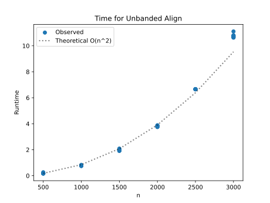
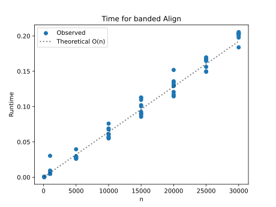

# Project Report - Alignment

## Baseline

### Design Experience

I talked with Kensey about the baseline and specifically about what is requried to return and the data structure that should be used. It is possible to do it with a list of lists, but it can increase the runtime, but it a dictionary is used where a tuple is the key then we can have faster ascess time. Then when talking about the return, I was a little. confused and she explained that it is the edit distance and both allignment strings.

### Theoretical Analysis - Unrestricted Alignment

#### Time 

This is going to be __O(n^2)__ because creating the table takes 2 for loops to ensure visiting every possible location. each of the helper functions don't contribute much to the time complexity since find_min is O(1) and get_path is at worst case O(n).
```
def align(...):                         # O(n^2)
    seq1length = len(seq1)
    seq2length = len(seq2)

    path = {}

    for i in range(seq2length+1):       # O(n)
        for j in range(seq1length+1):   # O(n)
            if i == 0 and j == 0:
                path[(i, j)] = (0, (0, 0))
            elif i == 0:
                path[(i, j)] = (path[(i, j-1)][0] + indel_penalty, (i, j-1))
            elif j == 0:
                path[(i, j)] = (path[(i-1, j)][0] + indel_penalty, (i-1, j))
            else:
                if seq2[i-1] == seq1[j-1]:
                    sub_values = path[(i-1, j-1)][0] + match_award
                else:
                    sub_values = path[(i-1, j-1)][0] + sub_penalty
                path[(i, j)] = find_min(...)                          # O(1)

    shortest_path = path[(seq2length, seq1length)][0]
    s1, s2 = get_path(...)                                            # O(n)

    return shortest_path, s1, s2
```

#### Space

The space is also going to be __O(n^2)__ beacuse the only thing we store is the table which has n times n entries in it. that can be shown in the code below in the double for loops that are creating that table.
```
def align(...):                         
    seq1length = len(seq1)
    seq2length = len(seq2)

    path = {}

    for i in range(seq2length+1):       # O(n) for letters in seq2
        for j in range(seq1length+1):   # O(n) for letters in seq1
            if i == 0 and j == 0:
                path[(i, j)] = (0, (0, 0))
            elif i == 0:
                path[(i, j)] = (path[(i, j-1)][0] + indel_penalty, (i, j-1))
            elif j == 0:
                path[(i, j)] = (path[(i-1, j)][0] + indel_penalty, (i-1, j))
            else:
                if seq2[i-1] == seq1[j-1]:
                    sub_values = path[(i-1, j-1)][0] + match_award
                else:
                    sub_values = path[(i-1, j-1)][0] + sub_penalty
                path[(i, j)] = find_min(...)                        

    shortest_path = path[(seq2length, seq1length)][0]
    s1, s2 = get_path(...) 

    return shortest_path, s1, s2
```

### Empirical Data - Unrestricted Alignment

| Size | Time (sec) |
| ---- | ---------- |
| 500  | 0.186      |
| 1000 | 0.773      |
| 1500 | 1.961      |
| 2000 | 3.805      |
| 2500 | 6.66       |
| 3000 | 10.755     |


### Comparison of Theoretical and Empirical Results - Unrestricted Alignment

- Theoretical order of growth: __O(n^2)__
- Empirical order of growth (if different from theoretical): __O(n^2.2)__




The plot shows that the data I gathered through my algorithm is actaully very close to that of the predicted O(n^2) most likely we are seeing a discrepancy due to just minor extra checking that I might be doing, and worst case on luck for running certain tests.

## Core

### Design Experience

I talked with Eric again for this and about how I should go about not computing the cells outside of the bandwidth. I had tottaly forgoten that for loops with a range can chagne between and outter itteration and this helped me figure this out. I also shared about how I need to switch my for loops around so that i was left and right and j up and down, because they were switched in the baseline and it messed me up more than anything.


### Theoretical Analysis - Banded Alignment

#### Time 

The time complexity is very similar to the baseline, but instead of computing the whole row of cells, we only do k of them which is 2*bandedwidth+1. So out final time complexity as anotated below in the code is __O(nk)__.
```
def align(...) -> tuple[float, str | None, str | None]: # O(nk)
    if banded_width == -1:
        return align_unbanded(seq1, seq2, match_award, indel_penalty, sub_penalty, banded_width, gap)
    

    seq1length = len(seq1)
    seq2length = len(seq2)
    if (len(seq1) < len(seq2)):
        smaller = len(seq1)
        larger = len(seq2)
    else:
        smaller = len(seq2)
        larger = len(seq1)

    if (larger - smaller) > banded_width:
        return (m.inf, None, None)
        
    path = {}
    

    for j in range(seq1length+1):                       # O(n)
        i_start = max(0, j-banded_width)
        i_end = min(seq2length, j+banded_width)

        for i in range(i_start, i_end+1):               # O(k)
            if i == 0 and j == 0:
                path[(i, j)] = (0, (0, 0))
                continue

            diag = path.get((i-1, j-1), (m.inf, None))[0]
            left = path.get((i-1, j), (m.inf, None))[0]
            up = path.get((i, j-1), (m.inf, None))[0]


            if i > 0 and j > 0:
                if seq2[i-1] == seq1[j-1]:
                    diag += match_award
                else:
                    diag += sub_penalty

            if left != m.inf:
                left += indel_penalty
            if up != m.inf:
                up += indel_penalty

            path[(i, j)] = find_min(i, j, diag, left, up)


    shortest_path = path[(seq2length, seq1length)][0]
    s1, s2 = get_path(path, seq2, seq1, seq2length, seq1length, gap)

    return shortest_path, s1, s2
```

#### Space

Space it also going to be less and actually the same as the time complexity. That is because we are only storing n times k things instead of both strings. So space is going to be __O(nk)__.
```
def align(...) -> tuple[float, str | None, str | None]:     # O(nk)
    if banded_width == -1:
        return align_unbanded(seq1, seq2, match_award, indel_penalty, sub_penalty, banded_width, gap)
    

    seq1length = len(seq1)
    seq2length = len(seq2)
    if (len(seq1) < len(seq2)):
        smaller = len(seq1)
        larger = len(seq2)
    else:
        smaller = len(seq2)
        larger = len(seq1)

    if (larger - smaller) > banded_width:
        return (m.inf, None, None)
        
    path = {}
    

    for j in range(seq1length+1):               # stores n things which is the smaller one
        i_start = max(0, j-banded_width)
        i_end = min(seq2length, j+banded_width)

        for i in range(i_start, i_end+1):       # only k of those n things
            if i == 0 and j == 0:
                path[(i, j)] = (0, (0, 0))
                continue

            diag = path.get((i-1, j-1), (m.inf, None))[0]
            left = path.get((i-1, j), (m.inf, None))[0]
            up = path.get((i, j-1), (m.inf, None))[0]


            if i > 0 and j > 0:
                if seq2[i-1] == seq1[j-1]:
                    diag += match_award
                else:
                    diag += sub_penalty

            if left != m.inf:
                left += indel_penalty
            if up != m.inf:
                up += indel_penalty

            path[(i, j)] = find_min(i, j, diag, left, up)


    shortest_path = path[(seq2length, seq1length)][0]
    s1, s2 = get_path(path, seq2, seq1, seq2length, seq1length, gap)

    return shortest_path, s1, s2
```

### Empirical Data - Banded Alignment

|  Size  | Time (sec) |
| ------ | ---------- |
| 100    | 0.0        |
| 1000   | 0.008      |
| 5000   | 0.029      |
| 10000  | 0.062      |
| 15000  | 0.098      |
| 20000  | 0.128      |
| 25000  | 0.163      |
| 30000  | 0.201      |

### Comparison of Theoretical and Empirical Results - Banded Alignment

- Theoretical order of growth: __O(nk)__
- Empirical order of growth (if different from theoretical): __O(n)__




*Fill me in*

### Relative Performance Of Unrestricted Alignment versus Banded Alignment

Bounded runs so much faster that undounded. Even on magnitudes of 10 larger inputs, bounded runs so much faster. This is a huge advantage, the only issue is that bounded will not always give you the most optimal path.


## Stretch 1

### Design Experience

I talked with Eric about this. We decided that all we needed to do for this was read the DNA strands, match each one to the unknown one, and then find the one with the lowest path. Seeing that these sequences were long we thought about doing banded, but then it could skip the best match and would not be smart for solving this crime.

### Code

```python
from alignment import align
import os
import math as m

def read_fasta(filepath):
    sequences = {}
    current_header = None
    current_seq = []
    
    with open(filepath, 'r') as f:
        for line in f:
            line = line.strip()
            if line.startswith('>'):

                if current_header:
                    sequences[current_header] = ''.join(current_seq)

                current_header = line[1:]
                current_seq = []
            else:
                current_seq.append(line)
        
        if current_header:
            sequences[current_header] = ''.join(current_seq)
    
    return sequences

def main():
    seqs = read_fasta('lct_exon8.txt')
    unknown_header, unknown_seq = seqs.popitem()
    best = m.inf
    for header, sequence in seqs.items():
        path, s1, s2 = align(sequence, unknown_seq)
        print(f"{header}: {path}")
        if path < best:
            best = path
            culprit = header
    
    print(f"culpirt: {culprit}")
```

### Alignment Scores

These are the allignment scores I got when running these against the Unkown DNA. Where the last line is our culprit.
```
uc002tuu.1_hg38_8_17 1551 1 1 chr2:135808443-135809993-: -3113
uc002tuu.1_panTro4_8_17 1551 1 1 chr2B:139763388-1397: -3097
uc002tuu.1_rheMac3_8_17 1551 1 1 chr13:116031545-1160: -3162
uc002tuu.1_canFam3_8_17 1551 1 1 chr19:38591470-385: -3111
uc002tuu.1_rn5_8_17 1551 1 1 chr13:50097887-500: -4343
uc002tuu.1_mm10_8_17 1551 1 1 chr1:128299839-1283: -3835

culpirt: uc002tuu.1_rn5_8_17 1551 1 1 chr13:50097887-500
```
## Stretch 2

### Design Experience

I talked with Sarah about this because my understanding of the algorithm was different from what the project wanted. I understood it as now being positive and maximizing thing, but the project wanted us to minimized, and take anything greater than zero out. this algoritm also returns what is similar instead of how to change it to be the same.

### Alignment Outcome Comparisons

##### Sequences and Alignments

I choose for this 2 Nephi 20 verse 1 and compared it with Isaiah 48 verse 1 to see the similarities and to see how many thing need to change to be the same. This also tells us where they differ and what words are missing.

align unbounded: (-405, '1 Hearken and hear this, O house of Jacob, wh--o are called by the name of Israel, and are come forth out of the waters of Judah, or out of the waters of baptism, who swear by the name of the Lord, and make mention of the God of Israel, yet they swear not in truth- nor in righteousness.', '1 Hear------- ye-- this, O house of Jacob, which are called by the name of Israel, and are come forth out of the waters of Judah,-------------- w------------hi----ch- swear by the name of the Lord, and make mention of the God of Israel, --but--------- not in truth, nor in righteousness.')

align bounded: (-382, '1 Hearken and hear this, O house of Jacob, wh--o are called by the name of Israel, and are come forth out of the waters of Judah, or out of the waters of baptism, who swear by the name of the Lord, and make mention of the God of Israel, yet they swear not in truth nor in righteousness.', '1 Hear------- ye-- this, O house of Jacob, which are called by the name of Israel, and are come forth out of the waters of Judah,-------------- w------------hi----ch- swear by the name of the Lord, and make mention of the God of Israel, but -not -----in-- trut--h, nor in righteousness.')

local align: (-417, ' this, O house of Jacob, wh--o are called by the name of Israel, and are come forth out of the waters of Judah, or out of the waters of baptism, who swear by the name of the Lord, and make mention of the God of Israel, yet they swear not in truth- nor in righteousness.', ' this, O house of Jacob, which are called by the name of Israel, and are come forth out of the waters of Judah,-------------- w------------hi----ch- swear by the name of the Lord, and make mention of the God of Israel, --but--------- not in truth, nor in righteousness.')

unbounded count: 287
bounded count: 286
similarities count: 269

##### Chosen Parameters and Better Alignments Discussion

By increasing the bounded cound we actaully get the same number as unbounded. At first it failed because the length difference was so large. but by increasing it we can get one letter less that the unbounded which shows how good the bounded algorithm actually is. Also I found, by changing the awards and penalties we can get different results that tell us knew things. turns out Isaiah and Nephi wrote very similar things.

unbounded count: 287
bounded count: 286
similarities count: 277

## Project Review

Overall this project was the most confusing for me just becuase of indexing. I had to re-write baseline because I passed due to consitency. Then by fixing that bounded was able to work with unbounded. This was also really cool to learn about how these can be used to help match DNA, or find similarities.
