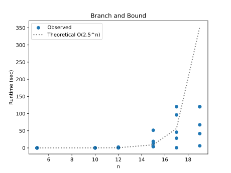
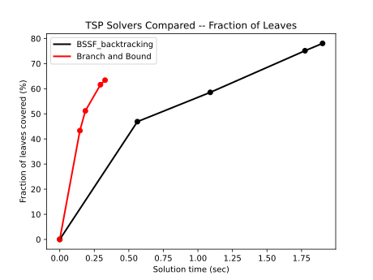
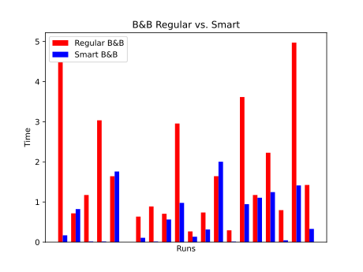

# Project Report - Branch and Bound

## Baseline

### Design Experience

I talked with Sarah about this part and more of what the best structure to use and about how we are doing to have to run through the columns twice no matter what. So I planned to use a dictionary to store it and then implment functions that just mutate the matrix and return it and the cost.

### Theoretical Analysis - Reduced Cost Matrix

#### Time 

The time for the reduce cost matrix is going to be __O(n^2)__ because building and reducing rows takes to passes. If we wanted to be even more precise it would have a constant in front of it because we have to perform the n^2 so many times.
```
def make_matrix(edges: list[list[float]]) -> dict[float]: # O(n^2)
    matrix = {}

    for j in range(len(edges)):     # O(n)
        for i in range(len(edges)): # O(n)
            if i == j:
                matrix[j, i] = math.inf
            else:
                matrix[j, i] = edges[j][i]

    return matrix

def reduce_matrix(edges: list[list[float]], m: dict[float]) -> int: # O(n^2)
    min_cost = 0
    min_row = math.inf
    row = 0
    col = 0
    finding = True

    while row < len(edges): # O(n^2)
        if finding:
            if col == len(edges):
                finding = False
                col = 0
                continue
            if m[row, col] < min_row:
                min_row = m[row, col]
            col += 1
        else:
            if col == len(edges):
                finding = True
                row += 1
                col = 0
                if min_row != math.inf:
                    min_cost += min_row
                    min_row = math.inf
            elif min_row == math.inf:
                col +=1
                continue
            else:
                m[row, col] = m[row, col] - min_row
                col +=1

    min_col = math.inf
    row = 0
    col = 0
    finding = True

    while col < len(edges): # O(n^2)
        if finding:
            if row == len(edges):
                finding = False
                row = 0
                continue
            if m[row, col] < min_col:
                min_col = m[row, col]
            row += 1
        else:
            if row == len(edges):
                finding = True
                col += 1
                row = 0
                if min_col != math.inf:
                    min_cost += min_col
                    min_col = math.inf
            elif min_col == math.inf:
                row +=1
                continue
            else:
                m[row, col] = m[row, col] - min_col
                row +=1
                
    return min_cost
            
def reduce_a_path(...) -> tuple[dict[float], int]: O(n^2)
    cur_cost += m[wasat, tovisit]
    m[tovisit, wasat] = math.inf
    for row in range(len(edges)):       # O(n)
        for col in range(len(edges)):   # O(n)
            if row == wasat:
                m[row, col] = math.inf
            elif col == tovisit:
                m[row, col] = math.inf
    
    cur_cost += reduce_matrix(edges, m) # O(n^2)
    return m, cur_cost
```

#### Space

The space for the matrix is just going to be __O(n^2)__ because we are storing a matrix that is n by n.
```
def make_matrix(edges: list[list[float]]) -> dict[float]: # O(n^2)
    matrix = {}

    for j in range(len(edges)):     # O(n)
        for i in range(len(edges)): # O(n)
            if i == j:
                matrix[j, i] = math.inf
            else:
                matrix[j, i] = edges[j][i]

    return matrix
```
 
## Core

### Design Experience

I talked with Jacob about this and we helped clear up something about when to be checking the lower bound is greater than the BSSF. I totally forgot why we needed to check when we popped and jacob helped clear that up.

### Theoretical Analysis - Branch and Bound TSP

#### Time 

The time I am going to guess that it is going to be around __O(5^n)__. For particualar reason besides a guess. 
```
def branch_and_bound(edges: list[list[float]], timer: Timer) -> list[SolutionStats]: # ~O(5^n)
    solutions = [greedy_tour(edges, Timer(1))[-1]]
    best = solutions[0].score
    matrix = make_matrix(edges)
    cost = reduce_matrix(edges, matrix)
    cur = []
    Q = []
    level = 0
    orginal = matrix.copy()

    Q.append((0, level, matrix.copy(), cost))

    while Q and not timer.time_out():   for every possible path
        P, call, m, c = Q.pop(0)

        if call < len(cur):
            cur.pop()
            Q = [(P, call, m, c)] + Q
        elif c > best:
            continue
        elif P not in cur:
            toappend = []
            cur.append(P)

            for p in range(len(edges)): # O(n)
                if len(cur) == len(edges):
                    if edges[P][cur[0]] != math.inf:
                        tour = Tour(cur)
                        cost = score_tour(tour, edges)
                        if cost < best:
                            solutions.append(SolutionStats(
                            tour=tour,
                            score=cost,
                            time=timer.time(),
                            max_queue_size=0,
                            n_nodes_expanded=0,
                            n_nodes_pruned=0,
                            n_leaves_covered=0,
                            fraction_leaves_covered=0))
                            best = cost
                        cur.pop()
                    break
                elif p in cur:
                    continue
                elif edges[P][p] == math.inf:
                    continue
                cur_m, cur_cost = reduce_a_path(edges, m.copy(), P, p, c)
                if cur_cost > best:
                    continue
                else:
                    toappend.append((p, call+1, cur_m, cur_cost))
                    
            Q = toappend + Q

    return solutions
```
#### Space

Space complexity for this is going to be __O(n^2)__ because of the reduced matrix being n by n. The solutions and queue will add to it, but they are both only O(n).
```
def branch_and_bound(edges: list[list[float]], timer: Timer) -> list[SolutionStats]: # O(n^2)
    solutions = [greedy_tour(edges, Timer(1))[-1]]
    best = solutions[0].score
    matrix = make_matrix(edges) # O(n^2)
    cost = reduce_matrix(edges, matrix)
    cur = []    # O(n) finite
    Q = []      # O(n) vaiarble
    level = 0
    orginal = matrix.copy()

    Q.append((0, level, matrix.copy(), cost))

    while Q and not timer.time_out():
        P, call, m, c = Q.pop(0)

        if call < len(cur):
            cur.pop()
            Q = [(P, call, m, c)] + Q
        elif c > best:
            continue
        elif P not in cur:
            toappend = []
            cur.append(P)

            for p in range(len(edges)):
                if len(cur) == len(edges):
                    if edges[P][cur[0]] != math.inf:
                        tour = Tour(cur)
                        cost = score_tour(tour, edges)
                        if cost < best:
                            solutions.append(SolutionStats(
                            tour=tour,
                            score=cost,
                            time=timer.time(),
                            max_queue_size=0,
                            n_nodes_expanded=0,
                            n_nodes_pruned=0,
                            n_leaves_covered=0,
                            fraction_leaves_covered=0))
                            best = cost
                        cur.pop()
                    break
                elif p in cur:
                    continue
                elif edges[P][p] == math.inf:
                    continue
                cur_m, cur_cost = reduce_a_path(edges, m.copy(), P, p, c)
                if cur_cost > best:
                    continue
                else:
                    toappend.append((p, call+1, cur_m, cur_cost))
                    
            Q = toappend + Q

    return solutions
```

### Empirical Data

| Size | Time (sec) |
| ---- | ---------- |
| 5    | 0.0        |
| 10   | 0.087      |
| 12   | 0.821      |
| 15   | 18.38      |
| 17   | 58.149     |
| 19   | 71.012     |

### Comparison of Theoretical and Empirical Results

- Empirical order of growth: __O(5^n)__
- Measured constant of proportionality: __O(2^n)__



This plot kind of shows the correct trend. so it do believe that is does follow this curve, the only issue is my machine was having some issue so I had to turn down the time out. But in any case this is not quite factorial, but definity exponetal.

## Stretch 1 

### Design Experience

I talked to Bob about this and we just talked about how it is the exact same as project backtracking stretch 1. But this time we will just be compariing the 2.

### Search Space Over Time



The graph here is showing us how both algorithms found the solutions, but BSSF had to cover way more leaves and took more time. Branch and bound covered about 15% less of the tree and found the solutions faster because we have the lower bound that helps keep us from searching usless paths.

## Stretch 2

### Design Experience

I talked with Eric about this and how it this could not just be done by using a priority queue on the lower bound because then it would just search the base nodes frist. basically doing a BFS. But if we do it by the height of the tree and then breaking ties with the lower bound then we can find a better solution faster and trim more parts of the tree.

### Selected PQ Key

lowerbound plus all non infinity entries in the reduced matrix.

### Branch and Bound versus Smart Branch and Bound

Below is a table and graph comparing the smart b and b and the regular b and b. The table shows the scores that came back for each of the different inputs after being solved. Most are the same because it was solved. However, if you look at the graph it shows the time it took to solve each one and most of them show that th regular branch and bound took a lot longer than the smart branch and bound.

| Run | Score (Regular) | Score (Smart) |
| --- | --------------- | ------------- |
| 1   | 4.484           | 0.169         |
| 2   | 0.717           | 0.822         |
| 3   | 1.174           | 0.013         |
| 4   | 3.036           | 0.013         |
| 5   | 1.642           | 1.76          |
| 6   | 0.0             | 0.0           |
| 7   | 0.635           | 0.107         |
| 8   | 0.888           | 0.012         |
| 9   | 0.706           | 0.563         |
| 10  | 2.956           | 0.977         |
| 11  | 0.266           | 0.134         |
| 12  | 0.738           | 0.314         |
| 13  | 1.643           | 2.003         |
| 14  | 0.293           | 0.01          |
| 15  | 3.616           | 0.946         |
| 16  | 1.174           | 1.106         |
| 17  | 2.227           | 1.246         |
| 18  | 0.796           | 0.044         |
| 19  | 4.973           | 1.412         |
| 20  | 1.424           | 0.328         |




## Project Report 

This was an interesting project. It was nice because most of the main code was already done. We were just implementing the reduciton matrix which was super cool that someone figured it out in the first place. I think also that if I had more time I could have made a better smart branch and bound than what I did. But it was cool to see how we can still improve it in a way that is not based on an algorithm and purley our mind.

