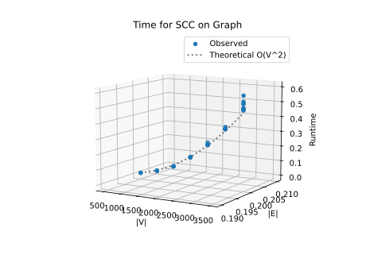
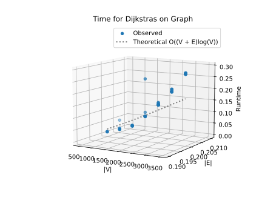
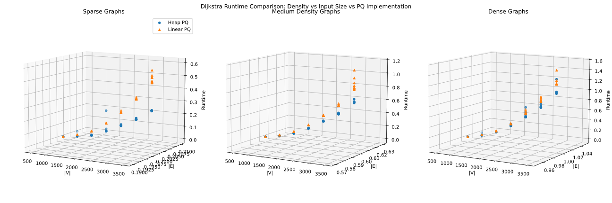
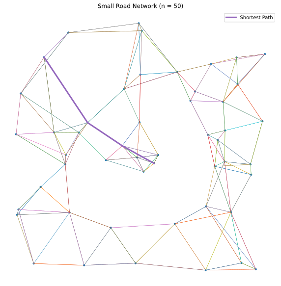
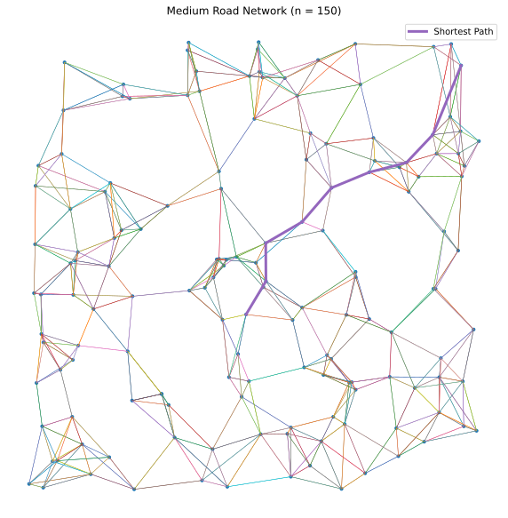
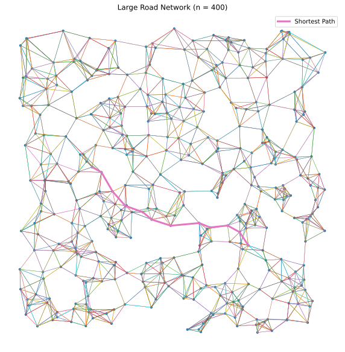

# Project Report - Network Routing

## Baseline

### Design Experience

I talked with Professor Mercer about this project, I first talked about how I was planning to do it with a class. But then that made it so I would have to implment a lot of simple functions inorder to do thinks like acess the dictionary. So I instead optided to just make a couple of helper functions. The other thing that we talked aobut is how priority means the current shortest distance that we know of. but the dist array is the actual shortest availabe.

### Theoretical Analysis - Dijkstra's With Linear PQ

#### Time 

Below is the annotated code that has most of the time consuming parts. From class and the code we see for Dijkstras method big-O is O(MQ + DM*V + DK*E) but since we are using a linear priority queue we know MQ, DM, and Dk and subsituing those in we get a final of __O(V^2)__.

```
def find_shortest_path_with_linear_pq(....) -> tuple[list[int],float]: O(n^2)

    prev = {}
    dist = {}
    queue = {}

    for n in graph:
        dist[n] = float("inf")
        queue[n] = float("inf")     # MQ by the end for LPQ O(n)
        prev[n] = "null"
    
    queue[source] = 0
    dist[source] = 0

    while not is_empty(queue):      # for each n
        u = deletemin(queue)        # DM for LPQ O(n)
        if u == None:
            break

        for v in graph[u]:          # for each e
            if v not in queue:
                continue
            elif queue[v] > dist[u] + graph[u][v]:
                queue[v] = dist[u] + graph[u][v]    # DK for LPQ O(1)
                prev[v] = u
                dist[v] = dist[u] + graph[u][v]

    path = get_path(prev, source, target, [])       # on worst case O(n)
    path.reverse()                                  # O(n)
    return (path, dist[target])
```

#### Space

Space is going to take up a little bit. We have 3 dictionaries and 1 array. These together need to build with each thing in it so big-O 4*n but would equate to __O(n)__.
```
def find_shortest_path_with_linear_pq(....) -> tuple[list[int],float]:

    prev = {}       # for each V
    dist = {}       # for each V
    queue = {}      # for each V

    for n in graph:
        dist[n] = float("inf")
        queue[n] = float("inf")     
        prev[n] = "null"
    
    queue[source] = 0
    dist[source] = 0

    while not is_empty(queue):     
        u = deletemin(queue)       
        if u == None:
            break

        for v in graph[u]:          
            if v not in queue:
                continue
            elif queue[v] > dist[u] + graph[u][v]:
                queue[v] = dist[u] + graph[u][v]    
                prev[v] = u
                dist[v] = dist[u] + graph[u][v]

    path = get_path(prev, source, target, [])   # worst case O(v)
    path.reverse()                                  
    return (path, dist[target])
```

### Empirical Data - Dijkstra's With Linear PQ

| V    | Density | time (sec) |
|------|---------|------------|
| 500  | 0.2     | 0.01       |
| 1000 | 0.2     | 0.037      |
| 1500 | 0.2     | 0.08       |
| 2000 | 0.2     | 0.155      |
| 2500 | 0.2     | 0.251      |
| 3000 | 0.2     | 0.366      |
| 3500 | 0.2     | 0.522      |

### Comparison of Theoretical and Empirical Results - Dijkstra's With Linear PQ

- Theoretical order of growth: __O(V^2)__ 
- Empirical order of growth (if different from theoretical): __O(V^2)__




This matches with with what I expected. Not its not exactly on, but it is very close. I would corelate that small differece to just how I coded the linear priority queue with deletemin and such.

## Core

### Design Experience

I talked with Mercer about the implementation of this one. I was trying to decide how I wanted to store things. At frist I was curious about using a list of list or a list of dictonaries, but then a list of tuples seemed best for the heap implementation. Then for keeping track of the location using a dictionary that holds its location in the queue.

### Theoretical Analysis - Dijkstra's With Heap PQ

#### Time 

The code below has annotations for each function showing what its time is. Each of the main DK, MQ, DM, and IK are known from lecture because of the implementation required. But using the equation from earlier we get a final time of __O((V + E)log(V))__
```
def find_shortest_path_with_heap(...) -> tuple[list[int], float]:
    """
    Find the shortest (least-cost) path from `source` to `target` in `graph`
    using the heap-based algorithm.

    Return:
        - the list of nodes (including `source` and `target`)
        - the cost of the path
    """
    prev = {}
    dist = {}
    queue = [(source, 0)]
    node_to_queue = {source: 0}
    i = 1

    for n in graph:             # whole for loop O(nlog(n))
        dist[n] = float("inf")
        prev[n] = "null"

        if n != source:
            queue.append((n, float("inf")))
            node_to_queue[n] = i
            i += 1

    dist[source] = 0

    while len(queue) != 0:
        u, udist = deleteminheap(queue, node_to_queue)  # O(log(n))

        for v in graph[u]:
            if v in node_to_queue:
                i = node_to_queue[v]
                vn, vd = queue[i]
                if vd > udist + graph[u][v]:
                    newvdist = udist + graph[u][v]
                    prev[v] = u
                    queue[i] = (vn, newvdist)          # this and re-short heap O(log(n))
                    dist[v] = newvdist
                    reshortheap(queue, i, node_to_queue)

    path = get_path(prev, source, target, [])
    path.reverse()
    return (path, dist[target])


def reshortheap(q : list, i : int, ntq : dict):     # O(log(n))
    cn, cd = q[i]

    while True:
        if i != 0 and cd < q[(i-1)//2][1]:
            ntq[q[(i-1)//2][0]] = i
            ntq[q[i][0]] = (i-1)//2
            q[(i-1)//2], q[i] = q[i], q[(i-1)//2]
            i = (i-1)//2
        elif (2*i+2) <= len(q)-1:
            if (2*i+2) <= len(q)-1 and cd > q[2*i+2][1] and q[2*i+2][1] < q[2*i+1][1]:
                ntq[q[2*i+2][0]] = i
                ntq[q[i][0]] = 2*i+2
                q[2*i+2], q[i] = q[i], q[2*i+2]
                i = 2*i+2
            elif (2*i+1) <= len(q)-1 and cd > q[2*i+1][1]:
                ntq[q[2*i+1][0]] = i
                ntq[q[i][0]] = 2*i+1
                q[2*i+1], q[i] = q[i], q[2*i+1]
                i = 2*i+1
            else:
                break
        elif (2*i+1) <= len(q)-1:
            if (2*i+1) <= len(q)-1 and cd > q[2*i+1][1]:
                ntq[q[2*i+1][0]] = i
                ntq[q[i][0]] = 2*i+1
                q[2*i+1], q[i] = q[i], q[2*i+1]
                i = 2*i+1
            else:
                break
        else: 
            break
    return


def deleteminheap(q : list, ntq : dict) -> tuple[int, int]:     # O(nlog(n))
    node, min = q[0] 

    if len(q) == 1:
        q.pop()
        ntq.__delitem__(node)
        return node, min
    
    ntq.__delitem__(node)
    newhead, newdist = q[len(q)-1]
    ntq[newhead] = 0
    q.pop()
    q[0] = (newhead, newdist)
    max = len(q)-1

    reshortheap(q, 0, ntq)      # O(nlog(n))

    return node, min
```

#### Space

The space is similar to when we used a linear priority queue, but we now have to store another set of values with how I did it. So techinacally it is 4*n for space, but that will just be a __O(n)__.
```
def find_shortest_path_with_heap(...) -> tuple[list[int], float]:
    """
    Find the shortest (least-cost) path from `source` to `target` in `graph`
    using the heap-based algorithm.

    Return:
        - the list of nodes (including `source` and `target`)
        - the cost of the path
    """
    prev = {}                   # O(v) each node
    dist = {}                   # O(v) each node
    queue = [(source, 0)]       # O(v) each node
    node_to_queue = {source: 0} # O(v) each node
    i = 1

    for n in graph:             # whole for loop O(nlog(n))
        dist[n] = float("inf")
        prev[n] = "null"

        if n != source:
            queue.append((n, float("inf")))
            node_to_queue[n] = i
            i += 1

    dist[source] = 0

    while len(queue) != 0:
        u, udist = deleteminheap(queue, node_to_queue)  # O(log(n))

        for v in graph[u]:
            if v in node_to_queue:
                i = node_to_queue[v]
                vn, vd = queue[i]
                if vd > udist + graph[u][v]:
                    newvdist = udist + graph[u][v]
                    prev[v] = u
                    queue[i] = (vn, newvdist)
                    dist[v] = newvdist
                    reshortheap(queue, i, node_to_queue)

    path = get_path(prev, source, target, [])
    path.reverse()
    return (path, dist[target])


def reshortheap(q : list, i : int, ntq : dict):
    cn, cd = q[i]

    while True:
        if i != 0 and cd < q[(i-1)//2][1]:
            ntq[q[(i-1)//2][0]] = i
            ntq[q[i][0]] = (i-1)//2
            q[(i-1)//2], q[i] = q[i], q[(i-1)//2]
            i = (i-1)//2
        elif (2*i+2) <= len(q)-1:
            if (2*i+2) <= len(q)-1 and cd > q[2*i+2][1] and q[2*i+2][1] < q[2*i+1][1]:
                ntq[q[2*i+2][0]] = i
                ntq[q[i][0]] = 2*i+2
                q[2*i+2], q[i] = q[i], q[2*i+2]
                i = 2*i+2
            elif (2*i+1) <= len(q)-1 and cd > q[2*i+1][1]:
                ntq[q[2*i+1][0]] = i
                ntq[q[i][0]] = 2*i+1
                q[2*i+1], q[i] = q[i], q[2*i+1]
                i = 2*i+1
            else:
                break
        elif (2*i+1) <= len(q)-1:
            if (2*i+1) <= len(q)-1 and cd > q[2*i+1][1]:
                ntq[q[2*i+1][0]] = i
                ntq[q[i][0]] = 2*i+1
                q[2*i+1], q[i] = q[i], q[2*i+1]
                i = 2*i+1
            else:
                break
        else: 
            break
    return


def deleteminheap(q : list, ntq : dict) -> tuple[int, int]:
    node, min = q[0] 

    if len(q) == 1:
        q.pop()
        ntq.__delitem__(node)
        return node, min
    
    ntq.__delitem__(node)
    newhead, newdist = q[len(q)-1]
    ntq[newhead] = 0
    q.pop()
    q[0] = (newhead, newdist)
    max = len(q)-1

    reshortheap(q, 0, ntq)

    return node, min
```

### Empirical Data - Dijkstra's With Heap PQ

| V    | Density | Time (sec) |
| ---- | ------- | ---------- |
| 500  | 0.2     | 0.008      |
| 1000 | 0.2     | 0.031      |
| 1500 | 0.2     | 0.047      |
| 2000 | 0.2     | 0.111      |
| 2500 | 0.2     | 0.15       |
| 3000 | 0.2     | 0.211      |
| 3500 | 0.2     | 0.287      |


### Comparison of Theoretical and Empirical Results - Dijkstra's With Heap PQ

- Theoretical order of growth: __O((V + E)log(V))__ 
- Empirical order of growth (if different from theoretical): ish __O((V^2) + E)__



There is a difference in the graph from the theoretical and the actual. This is probably because both my get_path and reverse path take a lot of time as the graphs get bigger. They are only O(n), but with both of those it just adds enough to create a difference in my run time graphs.

### Relative Performance Of Linear versus Heap PQ Performance

Deffinitly Heap PQ is better that Linear especially if implemented to that it is (V+E)long(V). It would for sure be faster that a Linear. Even with my implementation though I still get faster runtimes than a Linear. So overall it is better to go with a Heap if you know you are going to have large graphs.

## Stretch 1

### Design Experience

I talked with Issac about how this is just testing both implementation with different densities and seeing how they compare. We talked about how we should use the run time files given and then just plot the data that it gives.

### Empirical Data

| V    | Density | heap time (sec) | linear PQ time (sec) |
|------|---------|-----------------|----------------------|
| 500  | .6      |      0.014      |       0.016          |
| 1000 | .6      |      0.056      |       0.067          |
| 1500 | .6      |      0.119      |       0.145          |
| 2000 | .6      |      0.221      |       0.27           |
| 2500 | .6      |      0.351      |       0.436          |
| 3000 | .6      |      0.485      |       0.612          |
| 3500 | .6      |      0.678      |       0.925          |


| V    | Density | heap time (sec) | linear PQ time (sec) |
|------|---------|-----------------|---------------------|
| 500  | 1       |     0.022       |        0.025        |
| 1000 | 1       |     0.094       |        0.095        |
| 1500 | 1       |     0.187       |        0.21         |
| 2000 | 1       |     0.355       |        0.388        |
| 2500 | 1       |     0.585       |        0.641        |
| 3000 | 1       |     0.802       |        0.915        |
| 3500 | 1       |     1.105       |        1.29         |

### Plot



### Discussion

Each plots shows that as density goes up the run time increases. Unfortunalty my heap has some computation that makes it closer to linear than desired even though it has been implemented correctly. But when looking at the tables there is still a difference in times.

## Stretch 2

### Design Experience

I talked with Ted about this and basically the plan was to use ChatGPT to help creat a road plotting algorithm. I was a little confused at first, but we talked about how this is just creating an algorithm for the specific case and using it to plot a graph.

### Provided Graph Generation Algorithm Explanation

The graph generation algorithm models a transportation network by first placing cities in a two-dimensional geometric space using different spatial distributions (uniform, Gaussian, or circular). Roads are then randomly added between cities according to a specified density. Each road’s cost is based on the Euclidean distance between cities, with optional random noise added to simulate real-world factors such as traffic, terrain, or detours. Finally, Dijkstra’s algorithm is applied to compute the shortest path between two cities.

### Selected Graph Generation Algorithm Explanation

The algorithm that was used is called Geometric k-nearest-neighbor graph. It places cities in a 2D space and then connects each city to its k closest neighbors. Where k is a max distance. Then ensures conectivity by runing DFS and if a city is unreachable, connect it to the nearest reachable city.

#### Screenshots of Working Graph Generation Algorithm







## Project Review

This project overall was really fun. The hardest part was honestly just creating the data stracture and functions from stratch seeing that we have aready done this algorithm in past classes. My heap is being a little dumb with bothers me. I talked with a TA and he said it all looked implemented correct, but my runtime is still a little long. But I think the other cool part was being able to use our dijkstras on a random graph that we generated to show something like roads or maps.

