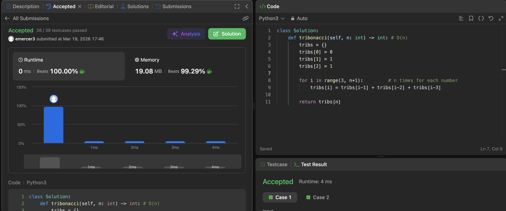
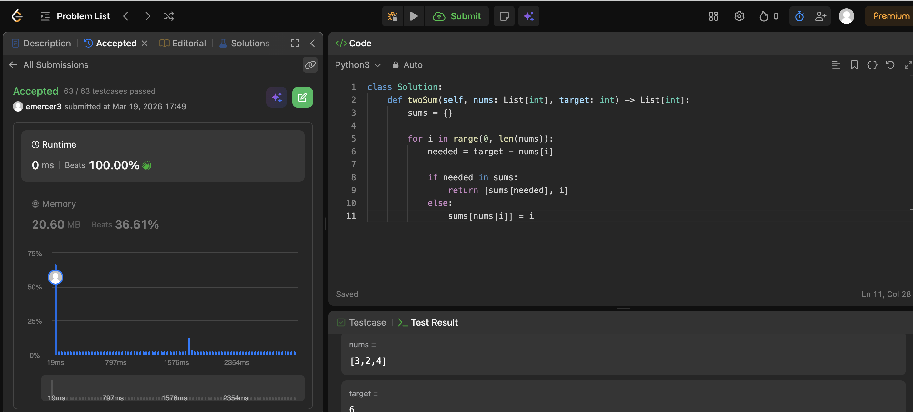
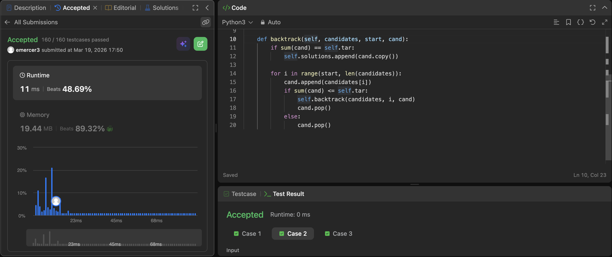
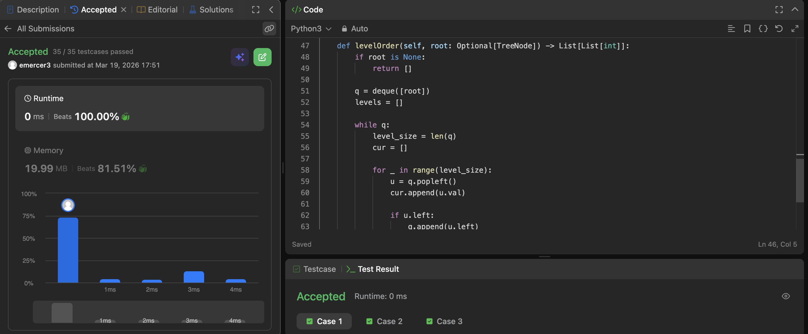
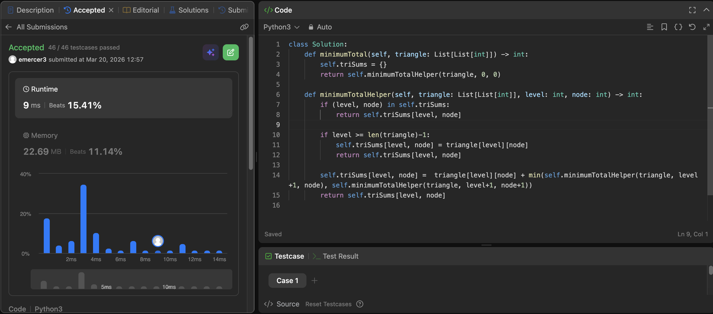
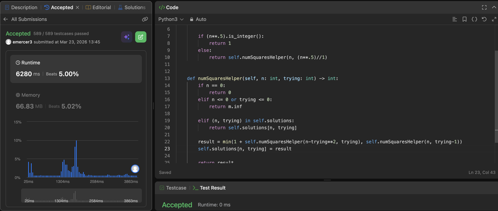

# Project Leetcode

## Baseline 

### Baseline Problem 1

#### Problem Information

Problem Name: 1137. N-th Tribonacci Number

[Submission Link](https://leetcode.com/problems/n-th-tribonacci-number/submissions/1953478424)


 
#### Time Complexity

The time complexity for this problem is just __O(n)__ because we are storing each of the 3 previous answer which makes this really easy.

```
def tribonacci(self, n: int) -> int: # O(n)
        tribs = {}
        tribs[0] = 0
        tribs[1] = 1
        tribs[2] = 1
        
        for i in range(3, n+1):         # n times for each number
            tribs[i] = tribs[i-1] + tribs[i-2] + tribs[i-3]
        
        return tribs[n]
```

#### Space Complexity

Space is also going to be __O(n)__ because we have to store a value for each of the inputs so this will grow to n.

```
fef tribonacci(self, n: int) -> int: # O(n)
        tribs = {}      # array for each of the n entries
        tribs[0] = 0
        tribs[1] = 1
        tribs[2] = 1
        
        for i in range(3, n+1):
            tribs[i] = tribs[i-1] + tribs[i-2] + tribs[i-3]
        
        return tribs[n]
```

----

### Baseline Problem 2

#### Problem Information

Problem Name: 1. Two Sum

[Submission Link](https://leetcode.com/problems/two-sum/submissions/1953479305)



#### Time Complexity

The time complexity is going to be about __O(n)__. This would be worst case since we are storing items and dynamically doing it. 
```
def twoSum(self, nums: List[int], target: int) -> List[int]: # O(n)
        sums = {}

        for i in range(0, len(nums)): # worst case is going to be n
            needed = target - nums[i]

            if needed in sums:
                return [sums[needed], i]
            else:
                sums[nums[i]] = i
```

#### Space Complexity

The space complexity is actually going to be the same as the time complexity of __O(n)__ because on the worst case we go through every entry and store it and the last one is the one we need.
```
def twoSum(self, nums: List[int], target: int) -> List[int]:    # O(n)
        sums = {} # initalizing the list to hold entries

        for i in range(0, len(nums)):
            needed = target - nums[i]

            if needed in sums:
                return [sums[needed], i]
            else:
                sums[nums[i]] = i   # worst case is storing every entry from the nums list
```

----

### Baseline Problem 3

#### Problem Information

Problem Name: 39. Combination Sum

[Submission Link](https://leetcode.com/problems/combination-sum/submissions/1953479598)



#### Time Complexity

The time complexity is going to be __O(n!)__ because we need to test every option with every option which should get smaller as you go down the tree.
```
def combinationSum(self, candidates: List[int], target: int) -> List[List[int]]:    # O(n!)
        self.tar = target
        self.solutions = []

        self.backtrack(candidates, 0, [])   # O(n!)

        return self.solutions

    def backtrack(self, candidates, start, cand): # O(n!)
        if sum(cand) == self.tar:
            self.solutions.append(cand.copy())

        for i in range(start, len(candidates)): # n times in candidates
            cand.append(candidates[i])
            if sum(cand) <= self.tar:
                self.backtrack(candidates, i, cand)
                cand.pop()
            else:
                cand.pop()
```

#### Space Complexity

Max recurseion depth storage for this is O(n), which makes cand the same so the most space will be used storing multiple cands. Thus the overall space complexity would be __O(n)__.
```
def combinationSum(self, candidates: List[int], target: int) -> List[List[int]]:
        self.tar = target
        self.solutions = []

        self.backtrack(candidates, 0, [])

        return self.solutions

    def backtrack(self, candidates, start, cand):
        if sum(cand) == self.tar:
            self.solutions.append(cand.copy())

        for i in range(start, len(candidates)):
            cand.append(candidates[i])
            if sum(cand) <= self.tar:
                self.backtrack(candidates, i, cand)
                cand.pop()
            else:
                cand.pop()
```
----


## Core

### Core Problem 1

#### Problem Information

Problem Name: 102. Binary Tree Level Order Traversal

[Submission Link](https://leetcode.com/problems/binary-tree-level-order-traversal/submissions/1953479923)



#### Time Complexity

This has to touch every node inorder to get the correct traversal. Bceause of that it will make this __O(n)__.
```
def levelOrder(self, root: Optional[TreeNode]) -> List[List[int]]:
        if root is None:
            return []

        q = deque([root])
        levels = []

        while q:        # q will hold every node so for sure n times
            level_size = len(q)
            cur = []

            for _ in range(level_size):
                u = q.popleft()
                cur.append(u.val)

                if u.left:
                    q.append(u.left)

                if u.right:
                    q.append(u.right)
            
            levels.append(cur)

        return levels
```

#### Space Complexity

The space is going to be about __O(n)__ because the queue will never be bigger than levels which holds the actually traversal. So the largest this can get is by how many nodes there are.
```
def levelOrder(self, root: Optional[TreeNode]) -> List[List[int]]: # O(n)
        if root is None:
            return []

        q = deque([root]) # stores each of the nodes at one level O(n)
        levels = [] # holds every node

        while q:
            level_size = len(q)
            cur = []    # for each level which grows for how many per level O(n)

            for _ in range(level_size):
                u = q.popleft()
                cur.append(u.val)

                if u.left:
                    q.append(u.left)

                if u.right:
                    q.append(u.right)
            
            levels.append(cur)

        return levels   # this will hold everything O(n)
```
----

### Core Problem 2

#### Problem Information

Problem Name: 120. Triangle

[Submission Link](https://leetcode.com/problems/triangle/submissions/1954227953)



#### Time Complexity

Since this algorithm checks every possible. path and then returns the shortest it will do it at most __O(n)__. However because we store paths to certain branches we will do it in less time than that.
```
def minimumTotal(self, triangle: List[List[int]]) -> int: # O(n)
        self.triSums = {}
        return self.minimumTotalHelper(triangle, 0, 0) # every path will be searched so at most the number of nodes

    def minimumTotalHelper(self, triangle: List[List[int]], level: int, node: int) -> int:
        if (level, node) in self.triSums:
            return self.triSums[level, node]

        if level >= len(triangle)-1:
            self.triSums[level, node] = triangle[level][node]
            return self.triSums[level, node]

        self.triSums[level, node] =  triangle[level][node] + min(self.minimumTotalHelper(triangle, level+1, node), self.minimumTotalHelper(triangle, level+1, node+1))
        return self.triSums[level, node]
```

#### Space Complexity

By storing the min path to each node the space for this will be just a tad less than __O(n)__.
```
def minimumTotal(self, triangle: List[List[int]]) -> int: # O(n)
        self.triSums = {}
        return self.minimumTotalHelper(triangle, 0, 0)

    def minimumTotalHelper(self, triangle: List[List[int]], level: int, node: int) -> int:
        if (level, node) in self.triSums:
            return self.triSums[level, node]

        if level >= len(triangle)-1:
            self.triSums[level, node] = triangle[level][node]
            return self.triSums[level, node]

        self.triSums[level, node] =  triangle[level][node] + min(self.minimumTotalHelper(triangle, level+1, node), self.minimumTotalHelper(triangle, level+1, node+1)) # for every node excpet bottom nodes
        return self.triSums[level, node]
```
----

### Core Problem 3

#### Problem Information

Problem Name: 279. Perfect Squares

[Submission Link](https://leetcode.com/problems/perfect-squares/submissions/1957110084)



#### Time Complexity

Since we branch into 2 new branches every time with a depth of n we get __O(2^n)__. But because we are pruning as we go it would be practically faster, but still worst case of 2^n.
```
def numSquares(self, n: int) -> int: # O(2^n)
        self.solutions = {}

        if (n**.5).is_integer():
            return 1
        else:
            return self.numSquaresHelper(n, (n**.5)//1) # O(2^n)
            

    def numSquaresHelper(self, n: int, trying: int) -> int: # overall depth of n
        if n == 0:
            return 0
        elif n <= 0 or trying <= 0:
            return m.inf

        elif (n, trying) in self.solutions:
            return self.solutions[n, trying]
        
        result = min(1 + self.numSquaresHelper(n-trying**2, trying), self.numSquaresHelper(n, trying-1)) # split into 2 choices
        self.solutions[n, trying] = result

        return result
```

#### Space Complexity

Space complexity is going to be __O(n^2)__ because on a worst case senario we try n with 1 every time and have to store that many things.
```
def numSquares(self, n: int) -> int: # O(n^2)
        self.solutions = {} # for each n and its corresponding square used(at most n times n/2)

        if (n**.5).is_integer():
            return 1
        else:
            return self.numSquaresHelper(n, (n**.5)//1)
            

    def numSquaresHelper(self, n: int, trying: int) -> int:
        if n == 0:
            return 0
        elif n <= 0 or trying <= 0:
            return m.inf

        elif (n, trying) in self.solutions:
            return self.solutions[n, trying]
        
        result = min(1 + self.numSquaresHelper(n-trying**2, trying), self.numSquaresHelper(n, trying-1)) # run for each n and t
        self.solutions[n, trying] = result

        return result
```
----

## Stretch 1

### Stretch 1 Problem 1

#### Problem Information

Problem Name: *fill me in*

[Submission Link]()


#### Time Complexity

*Fill me in*

#### Space Complexity

*Fill me in*

----

## Stretch 2

### Stretch 2 Problem 1

#### Problem Information

Problem Name: *fill me in*

[Submission Link]()


#### Time Complexity

*Fill me in*

#### Space Complexity

*Fill me in*

## Project Review

I talked with Kensey about the project. It was one of the TAs so I actually just talked through each of the problems I solved and what the main thing that helped me in that one. Like for example on binary tree traveral order once I realized that a queue was the best option it made so much more sense on how to do it. I also talked about how the hardest part was doing the time and space complexities.
