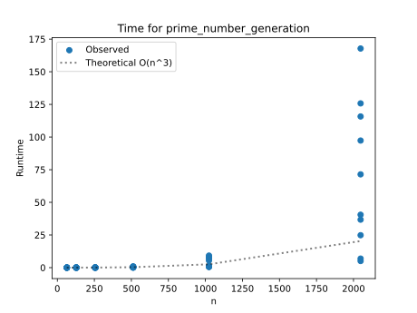
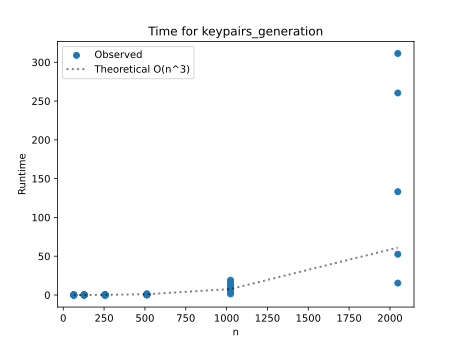
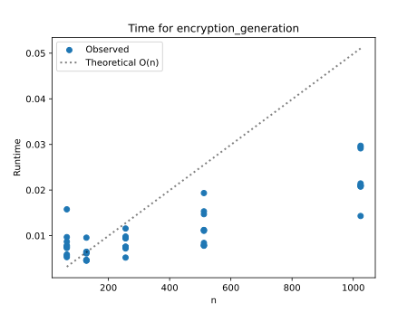
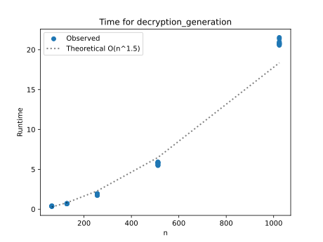

# Project Report - RSA and Primality Tests

## Baseline

### Design Experience

I talked with Doctor Mercer about how this first part of the code it just making sure I don't introduce errors when copying the pseudo code provided. I also talked about how big O  was probably going to be the hardest part for me. The baseline requirments were pretty straight forward so there was not much to talk about.

### Theoretical Analysis - Prime Number Generation

#### Time 

From what I gather and learned in class, this part is about __O(n^3)__. Generate_large_prime itself doesn't do any code that would be time consuming, but it does call other functions tha do. Which is mainly coming from the mod_exp function. I can't say exactly why, but professor grimsman helped us go through it and said it was about that.
```
def generate_large_prime(n_bits: int) -> int:                               # O(n^3)
    """Generate a random prime number with the specified bit length"""
    while (1):
        prime = random.getrandbits(n_bits)  # unsure
        if fermat(prime, 20):               # O(n^3)
            return prime                    # O(1)

def fermat(N: int, k: int) -> bool:                                         # O(n^3)
    """
    Returns True if N is prime
    """
    for i in range(1, k + 1):           # O(1)
        a = random.randint(2, N-1)      # O(1)
        if mod_exp(a, N-1, N) != 1:     # O(n^3)
            return False                # O(1)
    return True                         # O(1)

def mod_exp(x: int, y: int, N: int) -> int:     # O(n^3)
    """
    x^y mod(N)
    """
    if y == 0:                  # 0(1)
        return 1                # 0(1)
    z = mod_exp(x, y//2, N)     # 0(n^3)
    if y%2 == 0:                # 0(1)
        return (z*z) % N        # 0(n^2)
    else:
        return (x*z*z) % N      # 0(n^2)
```

#### Space

Most of the space used in generate_large_prime is going to be coming from mod_exp. It doesn't use a ton of space, but at worst case z would be stored n times so we would get a space of __n__. This is shown in how mod_exp has to store a bunch of values as it recusivly calls itself.

```
def generate_large_prime(n_bits: int) -> int:                               # O(n^3)
    """Generate a random prime number with the specified bit length"""
    while (1):
        prime = random.getrandbits(n_bits)  # unsure
        if fermat(prime, 20):               # O(n^3)
            return prime                    # O(1)

def fermat(N: int, k: int) -> bool:                                         # O(n^3)
    """
    Returns True if N is prime
    """
    for i in range(1, k + 1):           # O(1)
        a = random.randint(2, N-1)      # O(1)
        if mod_exp(a, N-1, N) != 1:     # O(n^3)
            return False                # O(1)
    return True                         # O(1)
    
def mod_exp(x: int, y: int, N: int) -> int:     # O(n^3)
    """
    x^y mod(N)
    """
    if y == 0:                  # 0(1)
        return 1                # 0(1)
    z = mod_exp(x, y//2, N)     # 0(n^3)
    if y%2 == 0:                # 0(1)
        return (z*z) % N        # 0(n^2)
    else:
        return (x*z*z) % N      # 0(n^2)
```

### Empirical Data

| N    | time (sec) |
|------|------------|
| 64   |   0.001    |
| 128  |   0.007    |
| 256  |   0.036    |
| 512  |   0.416    |
| 1024 |   4.165    |
| 2048 |   69.21    |

### Comparison of Theoretical and Empirical Results

- Theoretical order of growth: __n^3__ 
- Empirical order of growth (if different from theoretical): __3.1__ 



The observed data follows fairly close to a cubic line through 1024 bit input. At 2048 though, it is a large spread. I would be willing to gues that when average it is near n-cubed since a lot more points are down around that 20 on the runtime axis.

## Core

### Design Experience

I talked with Issac about this, I was confused at first about what values are fead into which functions. We talked about how p and q are needed for N and finding e and d. More specifically how when finding e and d we use (p-1) and (q-1) and never N. N is just a value returned and used.

### Theoretical Analysis - Key Pair Generation

#### Time 

Generating key-pairs is going to be about __O(n^3)__ becuase it calls generate_large_prime which from the baseline we just stated that it was O(n^3). However it will take longer that the than when we did the prior anylsis because we have to do a couple more things like use extended_euclids, but will be under the umbrella of O(n^3).

```
def generate_key_pairs(n_bits) -> tuple[int, int, int]:             # O(n^3)
    """
    Generate RSA public and private key pairs.
    Randomly creates a p and q (two large n-bit primes)
    Computes N = p*q
    Computes e and d such that e*d = 1 mod (p-1)(q-1)
    Return N, e, and d
    """
    p = generate_large_prime(n_bits)                    # O(n^3)
    q = generate_large_prime(n_bits)                    # O(n^3)

    N = p*q                                             # O(n^2)

    for e in primes:
        x, d, z = extended_euclids(((p-1)*(q-1)), e)    # O(n^2)
        if z == 1:
            d = d%((p-1)*(q-1))                         # O(n^2)
            return (N, e, d)                            # O(1)

def extended_euclids(a: int, b: int) -> tuple[int, int ,int]: # O(n^2)
    """
    this takes to numbers and finds the GCD
    """
    if b == 0:
        return (1, 0, a)                    # O(1)
    x, y, z = extended_euclids(b, a%b)    
    return (y, (x-(a//b)*y), z)             # O(n^2)
```

#### Space

Mod_exp and extended_euclids algorithims will also be taking the most space in generate_keypairs since it is recursive. But even then, on worst case it would be about __n__. These 2 lines of code from mod_exp and extended_euclids respectivly are what cause this from the general set of code below.
```
z = mod_exp(x, y//2, N)
```
```
x, y, z = extended_euclids(b, a%b)
```
```
def generate_key_pairs(n_bits) -> tuple[int, int, int]:             # O(n^3)
    """
    Generate RSA public and private key pairs.
    Randomly creates a p and q (two large n-bit primes)
    Computes N = p*q
    Computes e and d such that e*d = 1 mod (p-1)(q-1)
    Return N, e, and d
    """
    p = generate_large_prime(n_bits)                    # O(n^3)
    q = generate_large_prime(n_bits)                    # O(n^3)

    N = p*q                                             # O(n^2)

    for e in primes:
        x, d, z = extended_euclids(((p-1)*(q-1)), e)    # O(n^2)
        if z == 1:
            d = d%((p-1)*(q-1))                         # O(n^2)
            return (N, e, d)                            # O(1)

def extended_euclids(a: int, b: int) -> tuple[int, int ,int]: # O(n^2)
    """
    this takes to numbers and finds the GCD
    """
    if b == 0:
        return (1, 0, a)                    # O(1)
    x, y, z = extended_euclids(b, a%b)    
    return (y, (x-(a//b)*y), z)             # O(n^2)
```


### Empirical Data

| N    | time (sec) |
|------|------------|
| 64   |   0.002    |
| 128  |   0.011    |
| 256  |   0.062    |
| 512  |   0.541    |
| 1024 |   8.723    |
| 2048 |   154.55   |

### Comparison of Theoretical and Empirical Results

- Theoretical order of growth: __n^3__
- Empirical order of growth (if different from theoretical):  __n^3__



This graph shows how through 1024 bit inputs we track very close to n^3. At 2048 which only got 4 test run, not the full 10, it did not retain that. it is starting to look a little be more that n^3, maybe if avverage would have an exponent of 3.1 or 3.2.

## Stretch 1

### Design Experience

I also talked with Kensey for this part because I was slightly confused on how to go about doing it. But in talking with them I understood that I will be using the tools I just wrote to make a public and private key. With those I can encrypt and decrytp messages with a fellow student. Then for the anylsis stuff I will be using the 1Nephi text.

### Theoretical Analysis - Encrypt and Decrypt

#### Time 

Looking at the file all functions are stated to be O(n) but the transform function which has my implementation of mod_exp. 
From the basline stuff I said that it was about __O(n^3)__ so I would expect this time complexity to be about the same.
```
def transform(
        data: bytes,
        N: int,
        exponent: int,
        in_chunk_bytes: int,
        out_chunk_bytes: int,
) -> bytes:
    out = []
    # If there are M bytes in the file,
    # how many chunks are created,
    # and how big are those chunks in terms of n_bits?
    for block in chunks(data, in_chunk_bytes):
        if len(block) != in_chunk_bytes:
            raise ValueError("Input not aligned to chunk size.")
        x = int.from_bytes(block, "big")  # O (n)
        y = mod_exp(x, exponent, N)       # O(n^3)
        out.append(y.to_bytes(out_chunk_bytes, "big"))  # O(n)
    return b"".join(out)  # O(n)
```
#### Space

Space should be more space than the previous ones, but would still be about __n__ since we have the mod_exp. mod_exp being n and then in the transform function we have an append which also would take n space since the size of the array is dependent on how many bits it is.
```
y = mod_exp(x, exponent, N)       # O(n^3)
```
```
out.append(y.to_bytes(out_chunk_bytes, "big"))
```

### Empirical Data

| N    | encryption time (sec) | decryption time (sec) |
|------|-----------------------|-----------------------|
| 64   |        0.008          |         0.378         |
| 128  |        0.006          |         0.698         |
| 256  |        0.008          |         1.84          |
| 512  |        0.011          |         5.726         |
| 1024 |        0.023          |         20.902        |
| 2048 |         NA            |          NA           |

### Comparison of Theoretical and Empirical Results

#### Encryption

- Theoretical order of growth: __n^3__
- Empirical order of growth (if different from theoretical): __n__



So I predicted that this would be n^3 and I could not have been more wrong. This actually was an in between log(n) and n. I did test both, but n fit better. This should be n^3, but I believe that it is due to the fact that I got lucky in my generations for prime numbers, and because I was not able to run 2048 bit input. Another factor that could also affect it would just be hardware. I think that the inputs are just to low to show the difference in n^3.

#### Decryption

- Theoretical order of growth: __n^3__
- Empirical order of growth (if different from theoretical): __n^1.5__




I also predicted that decryption would take about O(n^3) but when I did it and plotted it I got more around O(n^1.5) which is not exact, as shown in graph, but is better than cubed. I would assume that this is the same as before. The function is getting lucky in generating primes and that there is not enough large inputs to show the n^3 growth.

### Encrypting and Decrypting With A Classmate

I did this with Damian right before lecture and it went great. He was able to get the message I sent him with his public key and it came out to be the correct message in the end. I found it kind of funny just how easy it was too.

## Stretch 2

### Design Experience

I talked with Sarah about the algorithm. We were confused about the exact details about it and when it fully terminated. From that I was able to get a good sense of what needed to happen in the code and was able to implement and pass the test faily quick onced done. Also after reading it was good to see how this is a better algorithm than the other one we used since it will tell us in it is prime with a better probability.

### Probabilistic Natures of Fermat and Miller Rabin

### Results

Testing the carmichael nuumbers showed just how easy it was to get inccorect responses from the fermat algorithim. But the nice thing was that Miller-rabin never failed those. For example I tested 1105, whish is a carmichael number, with 1 test run and Fermat said that it was a prime when Miller-Rabin said it was not.

### Discussion

I do understand the nature of it and how it has a probability to give a false positive. Since the fermat primality test is testing the same thing with multiple a values there is always a case that breaks it. Its proabaility is about a 1/2 chance that it is wrong, but with each k iteration it gets improved to (1/2)^k percent that it is wrong. With the miller rabin algorithm we still use different a's but we find and identiy that says when its -1 it is prime and we use that to always know that its right and will only get composite if we get anything thats not 1 or -1. This turns out to have a 1/4 chance that it is wrong, and with each interation it decreasaes as (1/4)^k that it is wrong. So we have a highier probabilty in failing the fermat than miller rabin.

## Project Review

This project overall was actually really cool and fun. The hardest part was just doing the theoretical time for each part. It turns out that I am not very good at it and was wrong more often than not. But I have a feeling that it will come with time and practice in the course. I also thought that implementing the algorithms was not too bad; the hardest part was just understanding the Miller–Rabin one because there were some nuances that were not explicitly stated but were important. Looking at some other peoples results I was not the only one who assumed some parts time complexity of O(n^3) when it was more to the 1.5/ constant time.

