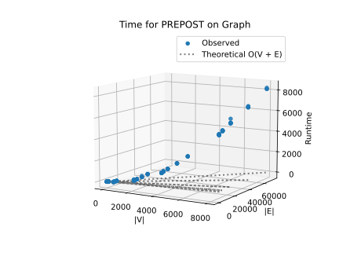
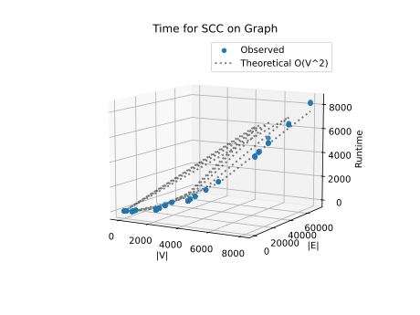

# Project Report - Network Analysis SCCs

## Baseline

### Design Experience

I talked with Dr Mercer again and we just talked about how this project was already implemented in CS 236. But when talking we also talked about how they would be stored in a a list or a stack. I did notice when reading the full baseline it talked about using a dictionary and we disccused that a little and why that would be nice to have.

### Theoretical Analysis - Pre/Post Order Traversal

#### Time 

The time for prepost is going to be __O(V + E)__ because even though there are some for loops, we only every visit each node and edge exactly once. As shown in the code below that is annotated.
```
def explore(g : GRAPH, n : str, dictlist : dict[str, list[int]], counter : int, visited : list[str]) -> tuple[list[str], dict[str, list[int]], int]:    # O(v + e)
    pre = counter                   # pre visit
    dictlist[n] = [pre, 0]
    visited.append(n)

    for branch in g[n]:                             # O(e)
        if branch not in visited:
            visited, dictlist, counter = explore(g, branch, dictlist, counter+1, visited)   # O(v)

    counter+= 1
    dictlist[n][1] = counter        # post visit
    return visited, dictlist, counter


def prepost(graph: GRAPH) -> list[dict[str, list[int]]]:        # O(V + E)
    """
    Return a list of DFS trees.
    Each tree is a dict mapping each node label to a list of [pre, post] order numbers.
    The graph should be searched in order of the keys in the dictionary.
    """
    DFSorders = []
    visited = []
    counter = 0

    for n in graph:                     # O(v)
        if n not in visited:
            counter+= 1
            visited, final, counter = explore(graph, n, {}, counter, visited)   # O(v + e)
            DFSorders.append(final)

    return DFSorders
```

#### Space

Space for prepost is going to be a little more than __O(V + E)__ but will be under the umbrela of it because we need to store each node with its pre and post. In my implimentation, I am also storing the nodes twice and I have a counter.
```
def explore(g : GRAPH, n : str, dictlist : dict[str, list[int]], counter : int, visited : list[str]) -> tuple[list[str], dict[str, list[int]], int]:    # O(v + e)
    pre = counter                   # pre visit
    dictlist[n] = [pre, 0]
    visited.append(n)

    for branch in g[n]:                             
        if branch not in visited:
            visited, dictlist, counter = explore(g, branch, dictlist, counter+1, visited)   # O(v)

    counter+= 1
    dictlist[n][1] = counter        # post visit
    return visited, dictlist, counter


def prepost(graph: GRAPH) -> list[dict[str, list[int]]]:        # O(V + E)
    """
    Return a list of DFS trees.
    Each tree is a dict mapping each node label to a list of [pre, post] order numbers.
    The graph should be searched in order of the keys in the dictionary.
    """
    DFSorders = []
    visited = []
    counter = 0

    for n in graph:                     
        if n not in visited:
            counter+= 1             # O (2*V)
            visited, final, counter = explore(graph, n, {}, counter, visited)   # O(v + e)
            DFSorders.append(final)

    return DFSorders
```

### Empirical Data

| Density | Size  | Time (sec) |
| ------- | ----- | ---------- |
| 0.25    | 10    | 0.005      |
| 0.25    | 50    | 0.045      |
| 0.25    | 100   | 0.153      |
| 0.25    | 500   | 4.809      |
| 0.25    | 2000  | 34.911     |
| 0.25    | 4000  | 133.781    |
| 0.25    | 8000  | 532.982    |
| 0.5     | 10    | 0.004      |
| 0.5     | 50    | 0.041      |
| 0.5     | 100   | 0.134      |
| 0.5     | 500   | 2.738      |
| 0.5     | 2000  | 42.292     |
| 0.5     | 4000  | 167.877    |
| 0.5     | 8000  | 668.045    |
| 1.0     | 10    | 0.004      |
| 1.0     | 50    | 0.05       |
| 1.0     | 100   | 0.162      |
| 1.0     | 500   | 3.839      |
| 1.0     | 2000  | 58.915     |
| 1.0     | 4000  | 247.606    |
| 1.0     | 8000  | 984.239    |
| 2.0     | 10    | 0.005      |
| 2.0     | 50    | 0.079      |
| 2.0     | 100   | 0.228      |
| 2.0     | 500   | 6.198      |
| 2.0     | 2000  | 100.078    |
| 2.0     | 4000  | 429.378    |
| 2.0     | 8000  | 1681.622   |
| 3.0     | 10    | 0.006      |
| 3.0     | 50    | 0.097      |
| 3.0     | 100   | 0.499      |
| 3.0     | 500   | 9.541      |
| 3.0     | 2000  | 147.476    |
| 3.0     | 4000  | 631.176    |
| 3.0     | 8000  | 2621.498   |

### Comparison of Theoretical and Empirical Results

- Theoretical order of growth: __O(V + E)__
- Empirical order of growth (if different from theoretical): __O(V + E)__



The Graph looks like the data runs longer than the Theorectical, but this is most likely due to the data structures that I used. I should have used a set, but I used a list which means that checking if an item is already in the list would take a longer. But I would say its close, because when chaning it it should very different results. So could maybe be ^1.5 power, but I think what it is is good.

## Core

### Design Experience

I talked with Professor Mercer again for this. I talked about how reversing the graph wasn't the hard part, it was getting the right order and reordering the graph so that my prepost would use that new order of evaulating.

### Theoretical Analysis - SCC

#### Time 

For finding SCCs I made a helper function to get the order for doing the DFS to find the SCCs and this is what is going to take the longest. In the code we see that everything is O(V + E) except for get_post_oder that is __O(V^2)__ which would be our final time.
```
def reverse_graph(graph: GRAPH) -> GRAPH:       # O(V + E)
    new_graph = {}

    for node in graph:                              # O(v)
        new_graph[node] = []
        for branch in graph[node]:                  # O(e)
            if branch not in new_graph:
                new_graph[branch] = [node]
            else:
                new_graph[branch].append(node)

    return new_graph


def get_post_order(graph: GRAPH, prepost: list[dict[str, list[int]]]) -> dict[str, list[str]]:  # O(v^2)
    trees = {}
    new_ordered_graph = {}

    for tree in prepost:    # O(v)
        trees.update(tree)

    for i in range(2*(len(trees)+1), 0, -1):    # O(2*v)
        for node in trees:                      # O(v)
            if trees[node][1] == i:
                new_ordered_graph[node] = graph[node]
    
    return new_ordered_graph

            
def sink_to_source(prepost: list[dict[str, list[int]]]) -> list[set[str]]:  # O(v)
    final = []

    for tree in prepost:    # O(v)
        set = []
        for node in tree:
            set.append(node)
        final.append(set)

    return final

            

def find_sccs(graph: GRAPH) -> list[set[str]]:  # O(V^2)
    """
    Return a list of the strongly connected components in the graph.
    The list should be returned in order of sink-to-source
    """
    reversed_graph = reverse_graph(graph)   # O(V+E)
    order = prepost(reversed_graph)         # O(V+E)
    new_ordered_graph = get_post_order(graph, order)    # O(v^2)
    scc = prepost(new_ordered_graph)        # O(V+E)
    return sink_to_source(scc)          # O(v)
```

#### Space

Space is not going to be very large because most of the functions are making a new graph or list and then disgarding the old one. Looking at find_sccs function I would assume that at worst case it would be around __O(V+E)__.

```         
def sink_to_source(prepost: list[dict[str, list[int]]]) -> list[set[str]]:  # O(v)
    final = []

    for tree in prepost:    # O(v)
        set = []
        for node in tree:
            set.append(node)
        final.append(set)

    return final

            

def find_sccs(graph: GRAPH) -> list[set[str]]:  # O(V+E)
    """
    Return a list of the strongly connected components in the graph.
    The list should be returned in order of sink-to-source
    """
    reversed_graph = reverse_graph(graph)   # O(V+E)
    order = prepost(reversed_graph)         # O(V+E)
    new_ordered_graph = get_post_order(graph, order)
    scc = prepost(new_ordered_graph)        # O(V+E)
    return sink_to_source(scc)          # O(v)
```

### Empirical Data


| Density | Size  | Time (sec) |
| ------- | ----- | ---------- |
| 0.25    | 10    | 0.02       |
| 0.25    | 50    | 0.235      |
| 0.25    | 100   | 0.805      |
| 0.25    | 500   | 19.759     |
| 0.25    | 2000  | 343.331    |
| 0.25    | 4000  | 1266.645   |
| 0.25    | 8000  | 5161.271   |
| 0.5     | 10    | 0.02       |
| 0.5     | 50    | 0.236      |
| 0.5     | 100   | 0.802      |
| 0.5     | 500   | 23.745     |
| 0.5     | 2000  | 323.118    |
| 0.5     | 4000  | 1346.895   |
| 0.5     | 8000  | 5415.306   |
| 1.0     | 10    | 0.019      |
| 1.0     | 50    | 0.262      |
| 1.0     | 100   | 0.906      |
| 1.0     | 500   | 21.582     |
| 1.0     | 2000  | 356.548    |
| 1.0     | 4000  | 1440.367   |
| 1.0     | 8000  | 5925.476   |
| 2.0     | 10    | 0.03       |
| 2.0     | 50    | 0.301      |
| 2.0     | 100   | 0.992      |
| 2.0     | 500   | 25.152     |
| 2.0     | 2000  | 418.977    |
| 2.0     | 4000  | 1669.054   |
| 2.0     | 8000  | 6896.355   |
| 3.0     | 10    | 0.024      |
| 3.0     | 50    | 0.354      |
| 3.0     | 100   | 1.242      |
| 3.0     | 500   | 28.399     |
| 3.0     | 2000  | 494.311    |
| 3.0     | 4000  | 1987.535   |
| 3.0     | 8000  | 8158.952   |


### Comparison of Theoretical and Empirical Results

- Theoretical order of growth: __O(V^2)__
- Empirical order of growth (if different from theoretical): __O(V^2)__



The theorectical line and data actually match very well and I would say that I got it about spot on. If any difference, I would say that it is due to this being worst case, and the get_post_order function runing faster and getting lucky.

## Stretch 1

### Design Experience

I talked with Professor Mercer about stretch 1. I was talking about how I this needed to be unfortunaly a use of 4 for loops. Obiviously those would be separeted and probably 2 of them in a for loop. But by doing this I can get each nodes pre and post and check it with every other nodes pre and post orders to classify it.

### Articulation Points Discussion 

An articulation point is a point in a graph that has no way to get forward or backward excpet through that point. there is also no paths between its children. An example of this would be __the BYU CS curriculum__ where nodes could be knowledge and skill set and the edges are classes. An artiulation point would be a requried class that requires a subset of knowledge and skills from past classes. there is no way to jump past the class and from that you can go 2 different class after. But these different classes cannot be prerequisits to the other class. It would be helpful to know this because then as staff you could put time into this class because it is an important one. The second example woul be __Traffic__ where nodes are interstections and edges are roads connecting those intersections. At an articulation point, the traffic would chose one road or the other and they drivers on each road would be cut off from the others. This helps show points of vulnerabilty where if an accident happends you could have a grid lock to parts of the city.

## Stretch 2

### Design Experience

I talked with Jacobus about stretch 2. We talked about how this is just using the tools we have created on a read data graph set. So I was planning to get data from the links given, limit some of the data, and then analysis it.

### Dataset Description

The Data set is a bunch of Wekipdia members and their votes since it was changed in 2003 to a voting election process. The data set is actually massive, so i made it a tad smaller for when I ran it through my functions.

### Findings Discussion

I found that in that giant set of data, we only had 4 strongly connected components that were more than just one person. But It meant that a lot of people voted multiple people and very connected amoung those few people.

## Project Review

Overall this project was fun because it was a great refresher to what we had done in CS236. I enjoyed also that the code was less written out and more problem solving was involved in it. I am starting to understand time complexity a little better now from this project. Especially because I went in and talked with a TA about it. It was kind of fun to anaylize it and then test it to see if you got the time complextiy right, which I did for the core portion. The other helpful thing I wanted to point out is that this can be used in many aplications and now I have a subset of code that can do it for me.
