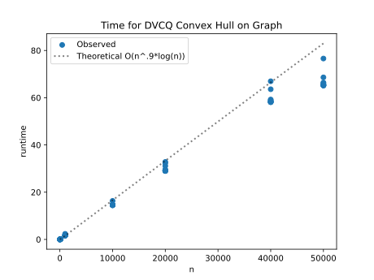
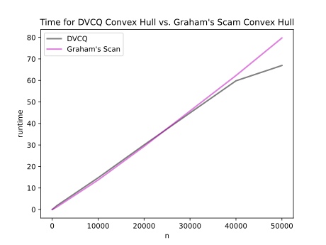
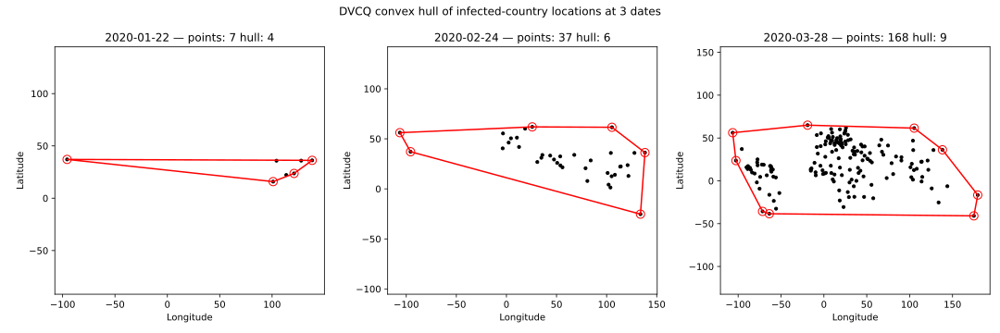

# Project Report - Convex Hull

## Baseline

### Design Discussion

I talked with Jacob about the baseline. We discussed about the base case for our divide and conquer algorithm, how it would be when we have 3 or less points. Then we figured out that our arrays that hold points would need to be ordered, but that it would be standard. So for me index 0 was always the furthest right point.

### Theoretical Analysis - Convex Hull Divide-and-Conquer

#### Time 

The time complexity for this is going to be __O(n*log(n))__ because the algorithm always halfs the current problem in to 2 subsets. This overall will have a log(n) shape. The only other part adding to that is that we have some O(n) cases in uppper and lower tangents.
```
def slope(c1, c2) -> float:                     # O(1)
    return (c1[1] - c2[1]) / (c1[0] - c2[0])


def find_upper_tangent(L: list[tuple[float, float]], R: list[tuple[float, float]]) -> tuple[float, float]:  # O(n)
    lind = 0
    rind = 0

    for i in range(0, len(R)):      # O(n)
        if R[i][0] < R[rind][0]:
            rind = i

    cur = slope(L[lind], R[rind])
    done = False

    while not done:
        done = True

        while cur > slope(L[(lind+1) % len(L)], R[rind]):   # O(n)
            lind = (lind+1) % len(L)
            cur = slope(L[lind], R[rind])
            done = False

        while cur < slope(L[lind], R[(rind+1) % len(R)]):  # O(n)
            rind = (rind+1) % len(R)
            cur = slope(L[lind], R[rind])
            done = False

    return (L[lind], R[rind])


def find_lower_tangent(L: list[tuple[float, float]], R: list[tuple[float, float]]) -> tuple[float, float]:  # O(n)
    lind = 0
    rind = 0

    for i in range(0, len(R)):
        if R[i][0] < R[rind][0]:
            rind = i

    cur = slope(L[lind], R[rind])
    done = False

    while not done:
        done = True

        while cur < slope(L[lind-1], R[rind]):
            lind = (lind-1) % len(L)
            cur = slope(L[lind], R[rind])
            done = False

        while cur > slope(L[lind], R[(rind-1) % len(R)]):  # might fail needs a check
            rind = (rind-1) % len(R)
            cur = slope(L[lind], R[rind])
            done = False

    return (L[lind], R[rind])


def combine(L: list[tuple[float, float]], R: list[tuple[float, float]]) -> list[tuple[float, float]]:   # O(n)
    Luptan, Ruptan = find_upper_tangent(L, R)   # O(n)
    Llowtan, Rlowtan = find_lower_tangent(L, R) # O(n)
    
    Luind = L.index(Luptan)     # O(n)
    Llind = L.index(Llowtan)    # O(n) 
    Ruind = R.index(Ruptan)     # O(n)
    Rlind = R.index(Rlowtan)    # O(n)

    new_hull = []

    i = Rlind
    new_hull.append(R[i])
    while i != Ruind:           # O(n)
        i = (i + 1) % len(R)
        new_hull.append(R[i])
    
    i = Luind
    new_hull.append(L[i])
    while i != Llind:           # O(n)
        i = (i + 1) % len(L)
        new_hull.append(L[i])

    rightmost = max(range(len(new_hull)), key=lambda i: new_hull[i][0])
        
    return new_hull[rightmost:] + new_hull[:rightmost]


def orientation(a, b, c):       # O(1)
    return (b[0] - a[0]) * (c[1] - a[1]) - (b[1] - a[1]) * (c[0] - a[0])


def base_assortment(points):    # O(1)
    if len(points) == 1:
        return points

    if len(points) == 2:
        # rightmost first
        if points[0][0] > points[1][0]:
            return [points[0], points[1]]
        else:
            return [points[1], points[0]]

    # 3 points (sorted by x)
    a, b, c = points

    turn = orientation(a, b, c) # O(1)

    if turn > 0:
        # CCW: a → b → c
        return [c, a, b]  # rotate
    else:
        # CW or collinear
        return [c, b, a]


def compute_hull(points: list[tuple[float, float]]) -> list[tuple[float, float]]: # O(n*log(n))
    size = len(points) 

    if size < 4:
        return base_assortment(points)  # O(1)

    L = points[:(len(points)//2)]
    R = points[(len(points)//2):]

    L_hull = compute_hull(L)    # both are half the original so over all will be log(n)
    R_hull = compute_hull(R)

    return combine(L_hull, R_hull)  # O(n)


def compute_hull_dvcq(points: list[tuple[float, float]]) -> list[tuple[float, float]]:  # O(n*log(n))
    """Return the subset of provided points that define the convex hull"""
    points.sort()       # O(nlog(n))
    return compute_hull(points)     # O(n*log(n))
```

#### Space

Space is going to take up more and one might think. We have to store everything in each subset with its hull and then build a new_hull from that. So I would suspect it to be __O(n)__. I pulled function not contributing to space out, but below is shown the code. We see that each one holds an array of some size, but it will be many so over all O(n).
```
def combine(L: list[tuple[float, float]], R: list[tuple[float, float]]) -> list[tuple[float, float]]:   # O(n)
    Luptan, Ruptan = find_upper_tangent(L, R)
    Llowtan, Rlowtan = find_lower_tangent(L, R)
    
    Luind = L.index(Luptan)     # O(n)
    Llind = L.index(Llowtan)    # O(n) 
    Ruind = R.index(Ruptan)     # O(n)
    Rlind = R.index(Rlowtan)    # O(n)

    new_hull = []   # will have more points, but is still another array O(n)

    i = Rlind
    new_hull.append(R[i])
    while i != Ruind:           
        i = (i + 1) % len(R)
        new_hull.append(R[i])
    
    i = Luind
    new_hull.append(L[i])
    while i != Llind:           
        i = (i + 1) % len(L)
        new_hull.append(L[i])

    rightmost = max(range(len(new_hull)), key=lambda i: new_hull[i][0])
        
    return new_hull[rightmost:] + new_hull[:rightmost]


def compute_hull(points: list[tuple[float, float]]) -> list[tuple[float, float]]:   # O(C*n) => O(n)
    size = len(points) 

    if size < 4:
        return base_assortment(points)  # O(1)

    L = points[:(len(points)//2)]
    R = points[(len(points)//2):]

    L_hull = compute_hull(L)    # will hold O(n) for each new hull
    R_hull = compute_hull(R)    # same here

    return combine(L_hull, R_hull)


def compute_hull_dvcq(points: list[tuple[float, float]]) -> list[tuple[float, float]]: # O(n)
    Return the subset of provided points that define the convex hull
    points.sort()       # O(nlog(n))
    return compute_hull(points)     # O(n)
```

## Core

### Design Discussion

I talked also with Eric about this part, Something was up in my tangents when I did a brief test before talking. We went over the example problem and then actually did the test_shared_tangent_point_dvcq by hand to better understand how it works. turns out I had an eniquality backwards that made it fail for core, but pass baseline tests.

### Empirical Data - Convex Hull Divide-and-Conquer

| Size   | Time (ms) |
| ------ | --------- |
| 10     | 0.012     |
| 100    | 0.126     |
| 1000   | 1.773     |
| 10000  | 14.754    |
| 20000  | 30.019    |
| 40000  | 59.82     |
| 50000  | 66.949    |

### Comparison of Theoretical and Empirical Results

- Theoretical order of growth: __O(n*log(n))__ 
- Empirical order of growth (if different from theoretical): __O(n^.9*log(n))__ 



The data is actually just a tad faster that my theoretical order of growth. This is most likely due to luck of the draw, especially because everything was done as worst case senario. But to be honest its about theorectical because n and n^.9 are very similar.

## Stretch 1

### Design Discussion

Since we could use AI I talked with Chat about this, it was a quite simple too. I suggested using one of the algorithms from the strech 1 specs/description and then the function call and it wrote it out with notes so that I could understand.

### Chosen Convex Hull Implementation Description

The used algorithm was Graham's Scan which chooses the lowest y value point and then computes the angle from that point to every other point in the set. From here it does the cross product to see if a point makes a turn into the hull and if it does it pops it, otherwise it adds it to the list of the hull.

### Empirical Data

| Size   | Time (ms) |
| ------ | --------- |
| 10     | 0.014     |
| 100    | 0.099     |
| 1000   | 1.144     |
| 10000  | 13.731    |
| 20000  | 29.334    |
| 40000  | 62.276    |
| 50000  | 79.729    |

### Comparison of Chosen Algorithm with Divide-and-Conquer Convex Hull

#### Algorithmic Differences

The main difference in this is that Graham's Scan doesn't divide and conquer, it just brutes it out in one go. So its n*log(n) time comes from sorting by polar angle, where as in dvcq the n*log(n) comes from the fact that we divide the set into 2 halves each time.

#### Performance Differences



Both of these algorithms are n*log(n), but from the graph we see that at the beginning Graham's Scan performs a little better, and then towards the end our dvcq method beats it. But overall they are basically the same in time complexity.

## Stretch 2

### Design Discussion

I talked with Eric about this milestone and more about how to prepare the data for the algorithm. The plan of attack was to for sure do it by time period and then by location. This would allow us to see how it spread geographically.

### Dataset 



Here we see how the Covid-19 pandemic spread over the rough times of early, middle and towards the end time periods. The convex hull allows us to see that spread in an easy way. From each one we see that it grows quite a lot and the hull itself stays small, but the points in way more.


## Project Review

This was actually a really fun project and it was brain teasing. Deffinitly harder to code than any of the other projects we have done. With that it came actually problem sovling, going over the algorithm and figuring out how to actually implement it. Because of this I really liked this one. It was also really cool to use this in a real world context and see how it could apply. I say that because I really couldn't see when you would use it, but having done it with the Covid-19 data set it allowed me to see the spread of it which was cool.

